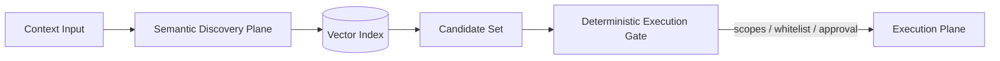
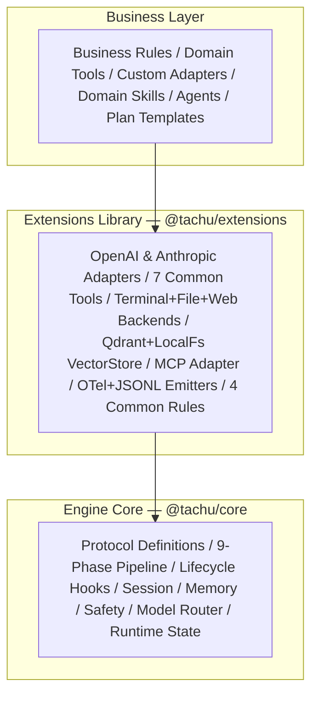
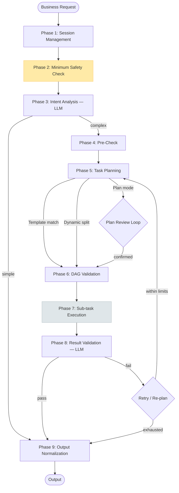

# Tachu

**An agentic engine under active development — the *Harness* that aims to turn any LLM into a reliable, observable Agent.**

[](https://www.npmjs.com/package/@tachu/core)
[](#project-status)
[](#license)
[](https://bun.sh)
[](https://www.typescriptlang.org)

> **⚠️ Project Status — Alpha.** The 9-phase pipeline, registry, prompt assembler, CLI, OpenAI / Anthropic / Qwen adapters, MCP adapters, vector stores and observability emitters are wired up and individually tested. **Phase 3 (Intent Analysis) is a real LLM call**, so `tachu chat` / `tachu run` produce real conversational replies. **Phase 5 (Planning) and Phase 8 (Result Validation) are still stubbed** — requests classified as *complex* will not yet receive an LLM-generated multi-step plan or semantic validation. See [Project Status](#project-status) and [Roadmap](#roadmap) for the per-feature breakdown. Do **not** use this in production yet. Install via the `@alpha` dist-tag.

---

## What is Tachu?

Tachu aims to be an **agentic engine you can build a real product on** — not a toy demo, not a thin wrapper. It is the *Harness* in the equation **Agent = Model + Harness**: it provides the structural skeleton (protocol, lifecycle, safety, memory, orchestration) so that any LLM becomes a reliable, observable Agent.

The engine is intentionally **domain-agnostic**: it knows nothing about your business logic, your users, or your domain vocabulary. Instead, it defines a small set of core abstractions (Rules, Skills, Tools, Agents) through which your business fills in all the intelligence. Tachu is designed to handle the hard parts — 9-phase execution pipeline, dual-plane semantic matching, context window management, token-precise prompt assembly, structured retry/fallback, cancellation propagation, and end-to-end observability.

Tachu ships as a Bun-native TypeScript monorepo with three packages: the zero-dependency engine core (`@tachu/core`), an official extensions library (`@tachu/extensions`), and a fully-featured CLI program (`@tachu/cli`) that doubles as the reference implementation.

---

## Project Status

**Current release:** `1.0.0-alpha.2` on the `alpha` dist-tag.

This is the **first public alpha** — most infrastructure is in place, but several LLM-backed stages are still stubbed. The table below is the single source of truth; every claim made elsewhere in this README must be cross-checked against it.

| Capability | Status | Notes |
|-----------|--------|-------|
| 9-phase pipeline skeleton (types, orchestrator, state machine, hooks) | ✅ Implemented | `packages/core/src/engine` |
| Descriptor Registry (Rules / Skills / Tools / Agents) | ✅ Implemented | Markdown + YAML frontmatter loader, semantic indexing, startup validation |
| Prompt assembler (tiktoken, KV-cache-friendly ordering) | ✅ Implemented | `packages/core/src/prompt` |
| Task scheduler, DAG validator, retry/fallback bookkeeping | ✅ Implemented | `packages/core/src/engine/scheduler.ts` |
| Session / Memory / Runtime-state / Safety / Model-router / Provider / Observability / Hooks modules | ✅ Implemented | `packages/core/src/modules` |
| OpenAI / Anthropic / Mock Provider adapters | ✅ Implemented | streaming, function calling, tool schemas |
| `apiKey` / `baseURL` / `organization` / `timeoutMs` configuration (env var / `tachu.config.ts` / CLI flags) | ✅ Implemented | Azure OpenAI / LiteLLM / OpenRouter / self-hosted gateways supported |
| 7 built-in tools + Terminal / File / Web backends | ✅ Implemented | `packages/extensions/src/{tools,backends}` |
| MCP stdio + SSE adapters | ✅ Implemented | `packages/extensions/src/mcp` |
| `LocalFsVectorStore` (file-backed) + `QdrantVectorStore` (REST) | ✅ Implemented | |
| OTel / JSONL / Console emitters | ✅ Implemented | |
| `tachu init` / `tachu run` / `tachu chat` CLI surface, streaming renderer, session persistence, Ctrl+C semantics | ✅ Implemented | |
| **CLI terminal Markdown rendering** | ✅ **Implemented** | `marked` + `marked-terminal` + `cli-highlight` stack. Applied to the final assistant reply in `tachu chat` / `tachu run --output text` when stdout is a TTY; automatically disables under `NO_COLOR` / non-TTY / `--no-color`. Explicit control via `--markdown` / `--no-markdown` on `tachu run`. Dedicated `renderMarkdownToAnsi` wrapper (`packages/cli/src/renderer/markdown.ts`) with 11 unit tests in `markdown.test.ts`. |
| **Phase 3 — Intent Analysis (LLM call, pure classification)** | ✅ **Implemented** | Routes through `ModelRouter.resolve("intent")` → registered `ProviderAdapter`. This phase is **pure classification** — `IntentResult = { complexity, intent, contextRelevance, relevantContext? }` only; the system prompt explicitly forbids `directAnswer` / `answer` / `reply` fields and the final user-facing answer is delegated to the `direct-answer` Sub-flow (Phase 7). Ships **5 few-shot examples** (greeting / creative short / write-code / write-lesson-plan / real multi-tool complex); complexity is anchored on *"does this need real tools / external resources?"*, not output length — single-turn long-form creative asks (write code, TDD lesson plans, essays, translations) stay `simple`. Bounded history window (up to 10 recent `MemorySystem` entries) and 30 s per-call timeout composed with the phase-level abort signal. Robust JSON extraction (plain / fenced / embedded); when the LLM ignores the JSON protocol but returns meaningful text, the text is accepted as the `intent` summary and the request still flows to `direct-answer`. Heuristic `intent = input.slice(0, 200)` fallback is used only on *no usable content* (provider unregistered, network / timeout error, cancellation, empty response). 10 dedicated tests in `intent.test.ts`. |
| **Phase 5 — Task Planning (fallback contract)** | ✅ **Implemented** | Enforces `plans[0].tasks.length >= 1`. Rules: (1) `simple` intent → single `direct-answer` sub-flow task; (2) `complex` + matched tools → first-N tool tasks (unchanged); (3) `complex` + no matching tool → single `direct-answer` sub-flow task with `warn: true` (the sub-flow honestly discloses the lack of tool matching); (4) defensive post-guard catches upstream regressions that leave `tasks` empty. Real LLM-backed planner (producing ranked multi-step plans for tool-chain complex requests) is still scheduled for a later alpha. |
| **`direct-answer` built-in Sub-flow (Phase 7)** | ✅ **Implemented** | `packages/core/src/engine/subflows/direct-answer.ts`. Resolves `capabilityMapping.intent` (fallback to `fast-cheap`), composes system + ≤10 memory-history entries + user prompt, calls `ProviderAdapter.chat()` with a 60 s per-call timeout merged with the phase abort signal. System prompt mandates **natural-language Markdown**, forbids JSON wrappers / `"已识别请求：…"` templates / 4-space indented code blocks, and supports a `warn: true` flag for honest tool-missing disclaimers. Emits `llm_call_start` / `llm_call_end` observability events under `phase: "direct-answer"`. Non-overridable: `DescriptorRegistry` registers `direct-answer` as a reserved name and rejects business registration / unregistration with `RegistryError.reservedName`. See [ADR 0001](docs/adr/decisions/0001-direct-answer-as-builtin-subflow.md). |
| **Phase 8 — Result Validation (LLM call)** | 🟡 **Stub** | Only checks whether any step `failed`; no semantic validation. Scheduled for a follow-up alpha. |
| **Phase 9 — Output Assembly** | ✅ **Implemented** | Content selector: `taskResults['task-direct-answer']` → `{intent, taskResults}` structured JSON (tool-chain success, reshape pending real Phase 5/8) → honest-fallback plain-language message with recognized intent + internal diagnosis + *"rephrase as simple"* suggestion (validation failed). Internal state JSON is never leaked to end users. 6 dedicated tests in `output.test.ts`. |
| Real-world smoke tests against OpenAI / Anthropic / Azure | 🔴 Not yet | Adapters are unit-tested with mocks; we have not yet published a signed-off end-to-end record. |
| Production hardening (SLO, error budgets, failure injection, signed provenance) | 🔴 Not yet | v1 target. |

Legend: ✅ implemented and tested · 🟡 stub / placeholder present, real implementation in progress · 🔴 not yet started.

---

## Key Features

> Features marked **(stub)** are wired end-to-end but do not yet call an LLM — see the [Project Status](#project-status) table.

- **9-Phase Execution Pipeline** — session management → safety → intent analysis (pure classification) → pre-check → planning (fallback contract) → DAG validation → execution → result validation *(stub)* → output normalization; each phase is a typed, hookable stage, and every request — simple or complex — flows through all nine phases with uniform Rules / Hooks / Observability / budget accounting
- **`direct-answer` built-in Sub-flow** — answers to simple requests (and to complex requests with no matching tool) are produced by a first-class engine-internal Sub-flow running in Phase 7, not baked into the intent prompt. See [ADR 0001](docs/adr/decisions/0001-direct-answer-as-builtin-subflow.md).
- **Dual-Plane Matching** — semantic discovery (vector similarity) + deterministic execution gate (scopes, whitelist, approval) for every Rule, Skill, Tool, and Agent
- **Four Core Abstractions** — declare Rules, Skills, Tools, and Agents as Markdown + YAML frontmatter descriptors; the engine resolves, activates, and orchestrates them automatically
- **OpenAI & Anthropic Adapters** — streaming, function calling, configurable `baseURL` / `organization` / `timeoutMs`; works with Azure OpenAI, LiteLLM, OpenRouter, or any self-hosted gateway
- **MCP Integration** — connect any MCP server (stdio or SSE) via `McpToolAdapter`; MCP tools become first-class engine Tools
- **Token-Precise Prompt Assembly** — tiktoken-based exact token counting; KV-cache-friendly prompt layout; automatic context compression (Head-Middle-Tail strategy)
- **Structured Memory** — session context window with configurable limits; archive-before-summarize guarantee; vector recall for long-term memory
- **OpenTelemetry Observability** — every phase entry/exit, LLM call, tool call, retry, and fallback emits a structured `EngineEvent`; OTel and JSONL emitters included
- **Interactive CLI** — `tachu chat` / `tachu run` / `tachu init` with full parameter sets, streaming render, session persistence, and Ctrl+C cancellation
- **Terminal Markdown rendering** — final assistant replies are rendered via `marked` + `marked-terminal` + `cli-highlight`; headings, bold / italic, lists, block quotes, links, tables and fenced code blocks (with syntax highlighting) are all supported. Automatically disabled under `NO_COLOR` / non-TTY / `--no-color`; explicitly controllable with `--markdown` / `--no-markdown` on `tachu run`.
- **Fail-Closed Safety Baseline** — loop protection, budget circuit-breaker, and basic input validation are hardwired into the engine and cannot be disabled
- **Qdrant & LocalFs Vector Stores** — plug in Qdrant for multi-process deployments or use the file-backed store for local/single-process setups

---

## Vision

> *太初有道，万物之始。以声明式描述符创造 Agent 万物。*
> *In the beginning was the Tao — all things arise from it. With declarative descriptors, conjure Agent capability from nothing.*

The long-term vision of Tachu is a universal Agent framework where **the engine provides the skeleton and business provides the blood**: any organization can build production-grade agentic systems on top of a stable, observable, auditable foundation without re-solving the hard problems of safety, context management, retry logic, and multi-provider orchestration every time.

Tachu is built around three convictions:

1. **The Harness is the hard part.** Model intelligence is commoditized; reliable orchestration is not. Tachu invests deeply in the engine infrastructure so application developers can focus on domain logic.
2. **Declaration over implementation.** Rules, Skills, Tools, and Agents are declared as plain Markdown files. The engine resolves them. No framework-specific boilerplate.
3. **Observable by default.** Every internal event is structured and emittable. Production systems need complete traces — Tachu provides them without opt-in instrumentation.

---

## Core Abstractions

Tachu's four core abstractions are **co-equal and orthogonal** — each independently registered, independently activated, and composable across all engine phases.

| Abstraction | Nature | Activation Gate | Effect |
|-------------|--------|-----------------|--------|
| **Rules** | Constraints & guidance | Semantic discovery → direct activation | Injected into LLM System Prompt at each scoped phase |
| **Skills** | Knowledge & instructions | Semantic discovery → direct activation | Injected into LLM context when activated |
| **Tools** | Atomic executable operations | Semantic discovery → **mandatory gate** (scopes → whitelist → approval) | Executed with full side-effect tracking |
| **Agents** | Natural-language-driven execution units | Semantic discovery → activatable | Recursively use engine capabilities; all Tool calls pass through the Tool gate |

All four share a **common descriptor schema** (Markdown + YAML frontmatter):

```yaml
name: unique-name             # required, unique within type
description: ...              # natural language (used for semantic discovery)
tags: [tag1, tag2]            # for filtering and classification
trigger: { type: always }     # activation condition
requires:
  - { kind: tool, name: read-file }  # explicit dependency references
```

### Dual-Plane Matching Model

Every core abstraction is activated through a two-phase process:



- **Semantic discovery plane**: `description` is vectorized on registration; at runtime, the current context is matched against the index to produce a candidate set
- **Deterministic execution gate**: final activation requires passing a deterministic gate (explicit references, whitelist checks, permission scopes, approval checks)

Rules and Skills pass through the gate freely (no side effects). Tools always pass through the full gate. Agents activate freely but all Tool calls they trigger still pass through the Tool gate.

---

## Architecture Overview

### Three-Layer Structure

Tachu is published as three layers:



| Layer | Package | Responsibility |
|-------|---------|----------------|
| Engine Core | `@tachu/core` | Protocol interfaces, 9-phase pipeline skeleton, 8 core modules, Registry, Prompt assembler, VectorStore interface + built-in light implementation |
| Extensions Library | `@tachu/extensions` | Official concrete implementations: Provider adapters, Tools, Backends, VectorStore adapters, OTel/JSONL emitters, common Rules |
| Business / CLI | `@tachu/cli` or your code | Assembles core + extensions into a working Agent; provides domain Rules/Skills/Tools/Agents |

### 9-Phase Execution Pipeline

Every request processed by the engine flows through exactly 9 phases:



| # | Phase | LLM Call | Key Output |
|---|-------|----------|------------|
| 1 | Session Management | No | Session context loaded |
| 2 | Minimum Safety Check | No | Pass / reject |
| 3 | Intent Analysis | **Yes** | `IntentResult` (simple/complex, context relevance) |
| 4 | Pre-Check | No | Resource availability, deep safety validation |
| 5 | Task Planning | **Yes** | `PlanningResult` (ranked plans + DAG) |
| 6 | DAG Validation | No | Cycle detection, node integrity (deterministic) |
| 7 | Sub-task Execution | Per sub-task | `TaskResult[]` (parallel where possible) |
| 8 | Result Validation | **Yes** | `ValidationResult` (pass / execution_issue / planning_issue) |
| 9 | Output Normalization | No | `EngineOutput` (typed, with steps, metadata, artifacts) |

**Key pipeline properties:**

- **Full-path safety gating** — Phase 2 runs on every request, including fast-path simple responses
- **Context guard** — Phase 3 decides whether session history is relevant; irrelevant history is not forwarded
- **Three-strikes limit** — Task-level retries are bounded at 3 (configurable); system-level retries at 2
- **Last-message-wins** — A new request on the same session cancels the current execution via `AbortController`

---

## Installation

Tachu requires [Bun](https://bun.sh) as the runtime.

> **Install via the `@alpha` dist-tag** (or an exact version) until Tachu reaches stable.

```bash
# Install the engine core (alpha)
bun add @tachu/core@alpha

# Install the extensions library (providers, tools, backends, vector stores)
bun add @tachu/extensions@alpha

# Install and use the CLI globally
bun add -g @tachu/cli@alpha
```

After global installation, verify with:

```bash
tachu --version   # expect 1.0.0-alpha.2 or newer
```

---

## Quick Start

### CLI

```bash
# 1. Initialize a new project workspace
tachu init --template minimal --provider openai

# 2. Set your API key (used by the OpenAI provider adapter)
export OPENAI_API_KEY=sk-...

# 3. Run a single prompt
tachu run "Summarize the last 5 git commits in this repository"

# 4. Start an interactive chat session
tachu chat

# Resume the most recent session
tachu chat --resume
```

### Programmatic (TypeScript)

```typescript
import { Engine } from '@tachu/core';
import { OpenAIProviderAdapter } from '@tachu/extensions/providers';
import { FileBackend, TerminalBackend } from '@tachu/extensions/backends';
import type { EngineConfig, InputEnvelope, ExecutionContext } from '@tachu/core';

const config: EngineConfig = {
  registry: {
    descriptorPaths: ['.tachu'],
    enableVectorIndexing: false,
  },
  runtime: {
    planMode: false,
    maxConcurrency: 4,
    defaultTaskTimeoutMs: 120_000,
    failFast: false,
  },
  memory: {
    contextTokenLimit: 8000,
    compressionThreshold: 0.8,
    headKeep: 4,
    tailKeep: 12,
    archivePath: '.tachu/archive.jsonl',
    vectorIndexLimit: 10_000,
  },
  budget: {
    maxTokens: 50_000,
    maxToolCalls: 50,
    maxWallTimeMs: 300_000,
  },
  safety: {
    maxInputSizeBytes: 1_000_000,
    maxRecursionDepth: 10,
    workspaceRoot: process.cwd(),
    promptInjectionPatterns: [],
  },
  models: {
    capabilityMapping: {
      'high-reasoning': { provider: 'openai', model: 'gpt-4o' },
      'fast-cheap':     { provider: 'openai', model: 'gpt-4o-mini' },
    },
    providerFallbackOrder: ['openai'],
  },
  observability: { enabled: true, maskSensitiveData: true },
  hooks: { writeHookTimeout: 5000, failureBehavior: 'continue' },
};

const engine = new Engine(config);

// Register a provider
engine.useProvider(new OpenAIProviderAdapter({ apiKey: process.env.OPENAI_API_KEY! }));

// Stream results
const input: InputEnvelope = {
  content: 'Write a TypeScript function that debounces async operations',
  metadata: { modality: 'text' },
};

const context: ExecutionContext = {
  requestId: crypto.randomUUID(),
  sessionId: 'session-001',
  traceId: crypto.randomUUID(),
  principal: { userId: 'user-001' },
  budget: { maxTokens: 20_000, maxDurationMs: 60_000 },
  scopes: ['read', 'write'],
};

for await (const chunk of engine.runStream(input, context)) {
  if (chunk.type === 'delta') process.stdout.write(chunk.content);
  if (chunk.type === 'done') console.log('\n\nCompleted:', chunk.output.status);
}
```

---

## Package Layout

### Package Summary

| Package | Description | Key Exports |
|---------|-------------|-------------|
| `@tachu/core` | Zero-dependency engine core | `Engine`, `Registry`, `PromptAssembler`, all interfaces and types |
| `@tachu/extensions` | Official implementations | `OpenAIProviderAdapter`, `AnthropicProviderAdapter`, `McpToolAdapter`, `QdrantVectorStore`, `OtelEmitter`, backends, tools, rules |
| `@tachu/cli` | Production CLI program | `tachu chat`, `tachu run`, `tachu init` |

### Dependency Relationship


### Core Package Internal Structure

```
@tachu/core / src/
├── types/          # All TypeScript interfaces: descriptors, context, I/O, config
├── engine/         # Engine entry class, phase handlers, orchestrator, scheduler
├── registry/       # Registry: register/lookup/startup validation for all 4 abstractions
├── modules/        # 8 core modules (session, memory, runtime-state, model-router,
│                   #   provider, safety, observability, hooks)
├── prompt/         # PromptAssembler: token budgeting, KV-cache-friendly ordering
└── vector/         # VectorStore interface + built-in lightweight implementation
```

---

## Providers & Integrations

### LLM Providers

| Provider | Package | Streaming | Function Calling | Notes |
|----------|---------|-----------|-----------------|-------|
| OpenAI | `@tachu/extensions/providers` | ✅ | ✅ | GPT-4o, GPT-4o-mini, and all listable models |
| Anthropic | `@tachu/extensions/providers` | ✅ | ✅ | Claude 3.5 Sonnet and all listable models |
| Mock | `@tachu/extensions/providers` | ✅ | ✅ | For testing; configurable responses |

Provider fallback is configured via `models.providerFallbackOrder`. When a system-level error occurs (timeout, API error), the engine automatically switches to the next provider in the list without re-planning.

### Provider Connection Configuration

Every built-in provider accepts `apiKey`, `baseURL`, `organization` (OpenAI-only), `project` (OpenAI-only), and `timeoutMs`. Supply them at any of three levels (later wins):

1. **Environment variables** (recommended for secrets):

   | Variable | Provider | Purpose |
   |----------|----------|---------|
   | `OPENAI_API_KEY` | OpenAI | Credential fallback when `apiKey` is not set |
   | `OPENAI_BASE_URL` | OpenAI | SDK-level baseURL override (honored by `openai` SDK) |
   | `ANTHROPIC_API_KEY` | Anthropic | Credential fallback when `apiKey` is not set |
   | `ANTHROPIC_BASE_URL` | Anthropic | SDK-level baseURL override (honored by `@anthropic-ai/sdk`) |

2. **`tachu.config.ts` — `providers` block** (recommended for non-secret connection metadata):

   ```typescript
   const config: EngineConfig = {
     // ...other fields
     providers: {
       openai: {
         // apiKey stays in env; keep this file commit-safe
         baseURL: 'https://your-gateway.example.com/v1',
         organization: 'org-xxxx',
         timeoutMs: 60_000,
       },
       anthropic: {
         baseURL: 'https://your-gateway.example.com/anthropic',
         timeoutMs: 60_000,
       },
     },
   };
   ```

3. **CLI flags** (highest priority; great for one-off overrides):

   ```bash
   tachu run "..." --provider openai \
     --api-base https://gateway.example.com/v1 \
     --api-key sk-dev \
     --organization org-xxxx

   tachu chat --provider anthropic \
     --api-base https://gateway.example.com/anthropic
   ```

   Flags apply to whichever provider the request ends up using — either the one supplied via `--provider`, or the one resolved from your `capabilityMapping`. CLI flags never touch the `mock` provider.

Typical use cases: Azure OpenAI, self-hosted LiteLLM / OpenRouter / Kong gateways, organization-wide egress proxies, and air-gapped environments.

### MCP (Model Context Protocol)

Tachu ships two official adapters for MCP (`McpStdioAdapter` / `McpSseAdapter`, built on `@modelcontextprotocol/sdk`) and the CLI wires them into `DescriptorRegistry` and the `TaskExecutor`—declare an `mcpServers` block in `tachu.config.ts`, and the CLI auto-discovers tools, routes calls, and disconnects on exit.

**Declarative config (recommended; field names align with the OpenAI Agents SDK and the common MCP client convention)**

```typescript
// tachu.config.ts
const config: EngineConfig = {
  // ... other fields
  mcpServers: {
    // Local stdio process (standard MCP stdio transport)
    fs: {
      command: 'npx',
      args: ['-y', '@modelcontextprotocol/server-filesystem', process.cwd()],
      env: { ...process.env },
    },
    // Remote SSE service (standard MCP SSE transport)
    remoteKb: {
      url: 'https://mcp.example.com/sse/',
      headers: { Authorization: `Bearer ${process.env.MCP_TOKEN ?? ''}` },
      timeoutMs: 50_000,
      connectTimeoutMs: 10_000,
      // Optional tachu extensions
      // description: 'Project documentation search (example)',
      // keywords: ['docs', '文档'],
      // expandOnKeywordMatch: true,
      // allowTools: ['getStatus'],
      // denyTools: ['dangerousOp'],
      // requiresApproval: true,
      // disabled: false,
      // tags: ['example'],
    },
  },
};
```

Semantics:

- **Namespacing** — remote tools are registered as `<serverId>__<originalName>` (e.g. `remoteKb__getStatus`) so multiple servers coexist without name clashes
- **Fault isolation** — any server failing to connect / list tools only emits a single stderr warning; other servers and the main flow keep running
- **Timeouts & cancellation** — `adapter.connect()` is wrapped by `connectTimeoutMs`; `ToolExecutionContext.abortSignal` is forwarded to `adapter.executeTool({ signal })`, so Ctrl+C / budget breaches propagate through the protocol layer
- **Approval gating** — MCP tool `requiresApproval` is OR-ed with the per-server `requiresApproval` and the tool-loop global flag; the CLI's default `y/N` prompt handles it uniformly
- **Lifecycle** — `tachu run` / `tachu chat` always call `engine.dispose()` then `mounted.disconnectAll()` in a `finally` branch; disconnect failures only emit warnings
- **LLM-facing `description`** — when provided, the per-server `description` is prefixed to every tool's description as `[<serverId>: <description>] <original>`, so the planner can route more accurately even without reading the full JSON schema
- **Keyword-gated tools (prompt-size optimization)** — a server with `expandOnKeywordMatch: true` and non-empty `keywords` is *not* registered at startup. `tachu run <prompt>` and each `you>` turn in `tachu chat` evaluate the user input against each server's keywords (case-insensitive substring match; structured input is `JSON.stringify`'d first) and only register tools from servers whose keywords hit. Use this to keep dozens of niche tools out of the default prompt while still making them reachable on demand — the schema validator refuses `expandOnKeywordMatch: true` without keywords

**SDK usage (when you bypass the CLI and assemble the engine yourself)**

```typescript
import { McpSseAdapter, McpStdioAdapter } from '@tachu/extensions';

const sse = new McpSseAdapter({
  url: 'https://mcp.example.com/sse/',
  serverId: 'remoteKb',
  headers: { Authorization: 'Bearer ...' },
  defaultTimeoutMs: 50_000,
});
await sse.connect('https://mcp.example.com/sse/');
const tools = await sse.listTools();
for (const tool of tools) await engine.registry.register(tool);

const stdio = new McpStdioAdapter({
  command: 'npx',
  args: ['-y', '@modelcontextprotocol/server-filesystem', process.cwd()],
  serverId: 'fs',
});
await stdio.connect('');
```

If you want the same "one block of config, auto-wired" experience inside a custom host, reuse `@tachu/cli`'s `mountMcpServers(config.mcpServers, { cwd })` / `setupMcpServersFromConfig(config, registry, { cwd })`—they return `{ descriptors, executors, disconnectAll }` that you can feed into `createEngine({ extraToolExecutors })`.

### Vector Stores

| Adapter | Package | Use Case |
|---------|---------|----------|
| `InMemoryVectorStore` | `@tachu/core` | Development / testing; built-in, zero dependencies |
| `LocalFsVectorStore` | `@tachu/extensions/vector` | Single-process production; file-backed persistence |
| `QdrantVectorStore` | `@tachu/extensions/vector` | Multi-process production; full Qdrant REST API support |

```typescript
import { QdrantVectorStore } from '@tachu/extensions/vector';

const vectorStore = new QdrantVectorStore({
  url: 'http://localhost:6333',
  collectionName: 'tachu-descriptors',
});

engine.useVectorStore(vectorStore);
```

### Observability Emitters

| Emitter | Package | Output |
|---------|---------|--------|
| `OtelEmitter` | `@tachu/extensions/emitters` | OpenTelemetry spans via `@opentelemetry/api` |
| `JsonlEmitter` | `@tachu/extensions/emitters` | Append-only JSONL file |
| `ConsoleEmitter` | `@tachu/extensions/emitters` | Structured console output (development) |

### Execution Backends

| Backend | Package | Description |
|---------|---------|-------------|
| `TerminalBackend` | `@tachu/extensions/backends` | Shell command execution in a sandboxed terminal |
| `FileBackend` | `@tachu/extensions/backends` | File system read/write operations |
| `WebBackend` | `@tachu/extensions/backends` | HTTP requests to external APIs / web resources |

---

## Design Principles

Tachu is built on seven core engineering principles drawn from its architecture:

1. **Dual-Plane Matching** — All four core abstractions are discovered semantically (vector similarity) but activated deterministically (scopes, whitelist, approval). Semantic discovery is advisory; execution gates are authoritative.

2. **Full-Path Safety Gating** — The minimum safety check (Phase 2) runs on *every* request path, including the fast path for simple questions. Safety is never traded for performance.

3. **Three-Strikes Retry Limit** — Both the task-level retry loop and the system-level retry loop are strictly bounded. Unlimited retry is not allowed. When limits are exhausted, the engine outputs step-level completion status rather than a generic failure.

4. **KV-Cache-Friendly Prompt Assembly** — The System Prompt is assembled in a stable order (hard rules → soft preferences → skills → tool definitions) so that the prefix remains unchanged across turns, maximizing KV cache reuse and reducing LLM cost.

5. **Last-Message-Wins Cancellation** — When a new message arrives in the same session, the current execution is cancelled via `AbortController` and the new input is processed in the existing context. This guarantees coherent context while avoiding stale work.

6. **Engine Agnostic of Business Permissions** — The engine only evaluates coarse-grained `scopes` from the execution context at the Tool gate. Fine-grained business authorization is the responsibility of Tool implementations or dedicated authorization Tools.

7. **Fail-Closed Safety Baseline** — Loop protection, budget circuit-breaking, and basic input validation are hardwired into the engine core and *cannot* be disabled by configuration. Even with a completely empty business configuration, the engine does not run unconstrained.

---

## Configuration

The engine is configured via a `tachu.config.ts` file at the project root (generated by `tachu init`):

```typescript
import type { EngineConfig } from '@tachu/core';

const config: EngineConfig = {
  // Descriptor registry: where Rules/Skills/Tools/Agents are loaded from
  registry: {
    descriptorPaths: ['.tachu'],
    enableVectorIndexing: false,       // set true to auto-index descriptors at startup
  },

  // Runtime behaviour
  runtime: {
    planMode: false,                   // when true, only plan but never execute tasks
    maxConcurrency: 4,                 // max parallel sub-tasks
    defaultTaskTimeoutMs: 120_000,     // single-task default timeout (ms)
    failFast: false,                   // any sub-task failure aborts the run
  },

  // Context window & memory
  memory: {
    contextTokenLimit: 8000,           // context window token limit
    compressionThreshold: 0.8,         // trigger compression at 80% capacity
    headKeep: 4,                       // earliest messages preserved during compression
    tailKeep: 12,                      // latest messages preserved during compression
    archivePath: '.tachu/archive.jsonl',
    vectorIndexLimit: 10_000,          // max entries in the built-in vector index
  },

  // Budget constraints (per execution)
  budget: {
    maxTokens: 50_000,                 // total token budget per execution
    maxToolCalls: 50,                  // max tool calls per execution
    maxWallTimeMs: 300_000,            // 5-minute wall-time limit
  },

  // Safety baseline (hardwired minimum; add business policies via SafetyModule.registerPolicy)
  safety: {
    maxInputSizeBytes: 1_000_000,
    maxRecursionDepth: 10,
    workspaceRoot: process.cwd(),      // file backend root (path-traversal guard)
    promptInjectionPatterns: [],       // optional regex strings; matches emit warnings only
  },

  // Model routing
  models: {
    capabilityMapping: {
      'high-reasoning': { provider: 'openai', model: 'gpt-4o' },
      'fast-cheap':     { provider: 'openai', model: 'gpt-4o-mini' },
      'vision':         { provider: 'openai', model: 'gpt-4o' },
    },
    providerFallbackOrder: ['openai', 'anthropic'],
  },

  // Observability (events emitted to ObservabilityEmitter)
  observability: {
    enabled: true,
    maskSensitiveData: true,           // auto-mask PII in event payloads
  },

  // Hooks
  hooks: {
    writeHookTimeout: 5_000,           // ms; mutating hooks exceeding this are skipped
    failureBehavior: 'continue',       // 'abort' to fail the run on any hook error
  },
};

export default config;
```

All fields have sensible defaults. `tachu init` generates this file pre-filled for your chosen provider.

> **Schema reference**: see detailed-design §14.1 for the full `EngineConfig` interface (and the historical-vs-v1 changelog). Earlier drafts that used `retry / planning / agent / context / execution / storage` keys are deprecated and will fail `validateConfig` with `VALIDATION_INVALID_CONFIG`.

---

## CLI Reference

### `tachu init`

Initialize a new Tachu project workspace.

```
tachu init [options]

Options:
  --template <name>    Scaffold template: minimal | full  (default: minimal)
  --force              Overwrite existing files without prompting
  --path <dir>         Target directory                   (default: CWD)
  --provider <name>    Default provider: openai | anthropic | mock  (default: mock)
  --no-examples        Skip generating example rule/tool descriptors
  -h, --help           Show help
```

Generates `.tachu/` directory skeleton + `tachu.config.ts` + `.gitignore` entries.

---

### `tachu run <prompt>`

Execute a single prompt and stream the result to stdout.

```
tachu run <prompt> [options]

Arguments:
  <prompt>             The prompt text (or pipe via stdin)

Options:
  --session <id>          Use a specific session ID
  --resume                Resume the most recent session
  --model <name>          Override the high-reasoning model
  --provider <name>       Override the default provider
  --api-base <url>        Override provider baseURL (gateway / Azure / LiteLLM)
  --api-key <key>         Override provider apiKey (env var still recommended)
  --organization <id>     Override OpenAI organization ID
  --input <file>          Read prompt from a file
  --json                  Parse prompt as JSON (structured input)
  --output <fmt>          Output format: text | json | markdown  (default: text)
  --markdown              Enable terminal Markdown rendering for --output text
                          (default: on when stdout is a TTY and NO_COLOR is unset)
  --no-markdown           Disable terminal Markdown rendering (force raw text)
  --no-validation         Skip Phase 8 result validation
  --plan-mode             Enable Plan mode (pause after Phase 5 for approval)
  --verbose, -v           Verbose output (phase transitions, each phase line has `(Nms)` duration appended)
  --debug                 Debug mode: implies --verbose and streams every engine observability
                          event (phase / llm / tool / MCP) to stderr, color-coded.
                          Safe for `-o json` pipelines (stdout is not polluted).
  --no-color              Disable ANSI color output (also respects NO_COLOR env var;
                          implies --no-markdown since Markdown rendering is color-based)
  --timeout <ms>          Wall-time limit (overrides budget.maxWallTimeMs)
  -h, --help              Show help
```

---

### `tachu chat`

Start an interactive multi-turn chat session.

```
tachu chat [options]

Options:
  --session <id>          Use a specific session ID
  --resume                Resume the most recent session
  --history               List all sessions and exit (no interactive prompt)
  --export <file>         Export a session to Markdown and exit
  --model <name>          Override the high-reasoning model
  --provider <name>       Override the default provider
  --api-base <url>        Override provider baseURL (gateway / Azure / LiteLLM)
  --api-key <key>         Override provider apiKey (env var still recommended)
  --organization <id>     Override OpenAI organization ID
  --plan-mode             Enable Plan mode
  --verbose, -v           Verbose output (phase lines carry `(Nms)` duration)
  --debug                 Debug mode: implies --verbose and streams observability events to stderr.
                          Also prints per-turn MCP gated-group activation summary.
  --no-color              Disable color output
  -h, --help              Show help
```

**Built-in interactive commands** (prefix with `/`):

| Command | Description |
|---------|-------------|
| `/exit` | Save session and quit |
| `/reset` | Clear the current session's memory |
| `/new` | Start a new session |
| `/list` | List all saved sessions |
| `/load <id>` | Switch to a specific session |
| `/save` | Manually persist the current session |
| `/export <path>` | Export session to a Markdown file |
| `/history` | Show this session's message history |
| `/stats` | Show token usage, tool calls, and remaining budget |
| `/help` | Show all commands |

**Ctrl+C behaviour:**
- First press: cancel the current LLM/Tool call (return to prompt, session intact)
- Second press within 1 second: save session and exit gracefully
- Third press: force exit

**Session persistence contract:**

`tachu chat` uses the `FsMemorySystem` from `@tachu/extensions` by default. Each conversation is written to `<cwd>/.tachu/memory/<session-id>.jsonl` on every `append` (append-only for crash safety). `--resume` and `--session <id>` hydrate the full history from that file on startup, then the engine continues inside the very same `MemorySystem` — so the LLM sees the complete prior context.

- `persistence` is controlled via `memory.persistence` in `tachu.config.ts` (`"fs"` default / `"memory"` for SDK-embedded use)
- `persistDir` defaults to `.tachu/memory`
- Legacy `tachu.config.ts` sessions that still embedded `messages` inside the session JSON are auto-migrated into the new `jsonl` layout on first resume (one-time, idempotent)
- `/history`, `/export <path>`, `/stats`, `/reset`, `/clear`, `/new`, `/load <id>` all operate against this single source of truth

---

## Extension Guide

Tachu is extended by creating Markdown descriptor files in the `.tachu/` directory. No code changes are required for Rules, Skills, and Tools — only Agents need executable functions registered separately.

### Custom Rule

```markdown
<!-- .tachu/rules/no-external-calls.md -->
---
name: no-external-calls
description: Prevent the agent from making external network calls without explicit approval
type: rule
scope: [execution]
tags: [security, network]
---

Do not make HTTP requests, DNS lookups, or any other external network calls unless
the tool being invoked has `requiresApproval: true` and the user has confirmed.
```

### Custom Skill

```markdown
<!-- .tachu/skills/git-workflow/SKILL.md -->
---
name: git-workflow
description: Git branching, commit, and PR workflow knowledge for this repository
tags: [development, git]
requires:
  - { kind: tool, name: run-command }
---

## Git Workflow

This repository follows trunk-based development with short-lived feature branches.

### Branch Naming
- Feature: `feat/<ticket>-<short-desc>`
- Fix: `fix/<ticket>-<short-desc>`

### Commit Convention
Use Conventional Commits: `type(scope): subject`
...
```

### Custom Tool

```markdown
<!-- .tachu/tools/query-db.md -->
---
name: query-db
description: Execute a read-only SQL query against the application database
sideEffect: readonly
idempotent: true
requiresApproval: false
timeout: 10000
inputSchema:
  type: object
  properties:
    sql:   { type: string, description: "SQL SELECT statement" }
    limit: { type: number, description: "Max rows to return", default: 100 }
  required: [sql]
execute: queryDatabase
---

Executes a parameterized read-only SQL query. Results are returned as a JSON array.
```

Register the execution function in your `engine-factory.ts`:

```typescript
engine.registry.registerExecutor('queryDatabase', async (input, ctx) => {
  const { sql, limit = 100 } = input as { sql: string; limit?: number };
  return db.query(sql).limit(limit).execute();
});
```

### Custom Agent

```markdown
<!-- .tachu/agents/code-reviewer.md -->
---
name: code-reviewer
description: Reviews pull request diffs and produces structured code review feedback
sideEffect: readonly
idempotent: true
requiresApproval: false
timeout: 180000
maxDepth: 1
availableTools: [read-file, search-code, run-command]
---

You are a careful code reviewer. When given a diff or a set of files:
1. Understand the intent of the change
2. Review for correctness, clarity, security, and performance
3. Produce a structured review with severity levels: critical / major / minor / nit
```

---

## Observability & Safety

### OpenTelemetry Integration

Every engine event maps to an OTel span, enabling full distributed tracing:

```typescript
import { OtelEmitter } from '@tachu/extensions/emitters';
import { NodeTracerProvider } from '@opentelemetry/sdk-trace-node';
import { SimpleSpanProcessor } from '@opentelemetry/sdk-trace-base';
import { OTLPTraceExporter } from '@opentelemetry/exporter-trace-otlp-http';

const provider = new NodeTracerProvider();
provider.addSpanProcessor(
  new SimpleSpanProcessor(new OTLPTraceExporter({ url: 'http://localhost:4318/v1/traces' }))
);
provider.register();

const engine = new Engine({
  ...config,
  // The OtelEmitter consumes EngineEvents and creates OTel spans
});
engine.useEmitter(new OtelEmitter());
```

**Events emitted for every request:**

| Event Type | When |
|-----------|------|
| `phase_enter` / `phase_exit` | Every pipeline phase |
| `llm_call_start` / `llm_call_end` | Every LLM invocation |
| `tool_call_start` / `tool_call_end` | Every Tool execution |
| `retry` | Task-level or system-level retry triggered |
| `provider_fallback` | Provider downgrade initiated |
| `budget_warning` | Budget at 80% of limit |
| `budget_exhausted` | Budget circuit-breaker activated |
| `error` | Any `EngineError` subclass |

### Safety Module

The Safety module operates in two independent layers:

**Engine baseline (non-disableable):**
- Input size enforcement (`maxInputSize` bytes)
- Recursion depth limit (`maxRecursionDepth`)
- Budget circuit-breaker (terminates immediately when token/time budget is exhausted)

**Business-injectable policies** (via hooks or configuration):
- Prompt injection detection (`enablePromptInjectionCheck: true`)
- Sensitive operation interception (register via `engine.registerSafetyPolicy()`)
- Output content compliance checks

```typescript
// Register a custom safety policy
engine.registerSafetyPolicy(async (input, ctx) => {
  if (containsPersonalData(input.content)) {
    return { passed: false, violations: [{ type: 'pii', message: 'PII detected in input' }] };
  }
  return { passed: true, violations: [] };
});
```

### Graceful Degradation Policy

Tachu guarantees that **every response the user sees is a usable natural-language answer** — the engine never returns a bare "failed" status or leaks internal step IDs / phase numbers / sub-flow names. Three defensive layers enforce this:

1. **Origin** — every `EngineError` ships with a `userMessage` field resolved from a Chinese template table (46 codes covered); `toUserFacing()` projects only `{ code, userMessage, retryable }` to the UI layer, hiding `message` / `stack` / `cause` / `context`.
2. **Aggregation** — when `validation.passed === false` and the built-in `direct-answer` sub-flow also produced nothing, Phase 9's `ensureFallbackText()` first attempts a best-effort LLM summary (5 s timeout, no retry) and silently falls back to a deterministic local template. The returned text is always **≥ 30 characters**, contains a concrete next-step hint, and is sanitized of internal terminology.
3. **Final shield** — the CLI `StreamRenderer` runs a last-pass regex filter (`sanitizeUserText`) over every user-visible string (`finalize(text|markdown)` + `error` chunks), catching any internal term that might have slipped through upstream.

The contract is enforced by `packages/core/src/engine/phases/fallback-contract.test.ts` (55 assertions). Any regression that leaks `task-tool-N` / `Phase N` / `direct-answer 子流程` / `capability 路由` / `Tool / Agent 描述符` to a user-facing path fails CI.

---

## Roadmap

Tachu follows a `1.0.0-alpha.n` → `1.0.0-beta.n` → `1.0.0` release lane. Each
cut-line below is a real, shippable deliverable with tests, not a wish list.

### 1.0.0-alpha.2 — Adapter call context (current)

- [x] `AdapterCallContext` on `ProviderAdapter` / `VectorStore` / `MemorySystem`; engine and phases pass execution-derived context (trace id; optional tenant / scope identifiers).

### 1.0.0-alpha.1 — First public alpha

- [x] 9-phase pipeline, descriptor registry, prompt assembler, scheduler and 8 core modules
- [x] OpenAI / Anthropic / Qwen / Mock provider adapters with
      `apiKey` / `baseURL` / `organization` / `timeoutMs` configurable via env,
      `tachu.config.ts` or CLI flags
- [x] CLI (`tachu init` / `run` / `chat`) with streaming renderer, session
      persistence, double-Ctrl+C exit semantics and terminal Markdown rendering
- [x] MCP stdio + SSE adapters, auto-mounted from `tachu.config.ts`
- [x] Vector stores (`LocalFsVectorStore`, `QdrantVectorStore`) and
      observability emitters (OTel / JSONL / Console)
- [x] `direct-answer` built-in Sub-flow — reserved in the registry, runs the
      user-facing LLM reply inside Phase 7 with the same safety and
      observability hooks as any other sub-flow
- [x] `tool-use` built-in Sub-flow — full agentic loop with tool selection,
      approval, execution, feedback and termination
- [x] Phase 3 (Intent Analysis) as a real LLM call with structured JSON schema,
      few-shot examples, bounded history window and composed timeouts
- [x] Phase 5 fallback contract — guarantees `plans[0].tasks.length >= 1` for
      every request path; LLM-backed ranked planner slated for next alpha
- [x] Phase 9 Output Assembly — internal state JSON never leaks to end users
- [x] Optional `@tachu/web-fetch-server` sidecar powering the `web-fetch` and
      `web-search` tools without pulling browser dependencies into the SDK
- [x] Structured text-to-image contract (`ChatResponse.images` /
      `EngineOutput.metadata.generatedImages`) and `tachu run --save-image`

### Next alpha iterations

- [ ] LLM-backed Phase 5 planner producing ranked multi-step plans for
      tool-chain complex requests
- [ ] Phase 8 Result Validation as a real LLM call with structured
      `ValidationResult` driving the retry / re-plan loop
- [ ] `tachu run --plan-mode` real plan preview before execution
- [ ] Engine-level `delta` streaming so CLI can render token-by-token output
      during Phase 3 / 7 / 8
- [ ] `tachu run --json` schema lock-down
- [ ] Failure-injection test harness
- [ ] Published end-to-end smoke test recordings under `docs/smoke/`

### 1.0.0-beta — Graduation criteria

- [ ] Two consecutive alpha releases without regressions
- [ ] ≥1 third-party user has run Tachu end-to-end against a real LLM and reported back
- [ ] Published coverage + benchmark baselines
- [ ] Public upgrade guide covering every breaking change since `1.0.0-alpha.1`
- [ ] Additional provider adapters (Gemini, Mistral) land behind the stable protocol

### 1.0.0 — Stable

- [ ] SLO / error-budget documentation
- [ ] Signed release provenance
- [ ] Backwards-compatibility policy
- [ ] Production deployments documented

### Beyond 1.0 — Vision

- Multi-agent collaboration (agent-to-agent communication protocol)
- Persistent long-term memory across deployment restarts
- Fine-grained budget allocation per sub-task
- Additional VectorStore adapters (Pinecone, pgvector)
- Plan template library
- Additional compression strategies

---

## Contributing

### Requirements

- [Bun](https://bun.sh) >= 1.1.0
- TypeScript 5.x (provided via dev dependencies)

### Development Workflow

```bash
# Clone and install
git clone https://github.com/dangaogit/tachu.git
cd tachu
bun install

# Run all tests
bun test

# Type check
bun run typecheck

# Build all packages
bun run build

# Run a specific package's tests
bun test --filter packages/core
```

### Project Conventions

- File names: `kebab-case`
- Classes and types: `PascalCase`
- Functions and variables: `camelCase`
- Constants: `SCREAMING_SNAKE_CASE`
- All public APIs must have TSDoc comments (`@param`, `@returns`, `@throws`, `@example`)
- Test files co-located with source: `*.test.ts`
- Integration tests under `__tests__/`

Pull requests require:
- All tests passing (`bun test`)
- Zero TypeScript errors (`bun run typecheck`)
- Coverage thresholds met (≥80% line, ≥70% branch)
- TSDoc on any new public API

See `CONTRIBUTING.md` for full guidelines.

---

## Benchmarks

Performance baselines are established in `packages/core/benchmarks/` and run with `bun test`:

| Benchmark | Metric | Baseline |
|-----------|--------|----------|
| `scheduler.bench.ts` — 100 parallel tasks | Scheduling throughput | *Populated by verifier phase* |
| `vector-store.bench.ts` — 10,000 entries, topK=10 | Search QPS | *Populated by verifier phase* |
| `prompt-assembler.bench.ts` — 4K token window assembly | Assembly latency (p99) | *Populated by verifier phase* |

Benchmarks serve as regression baselines; there are no minimum performance requirements for v1.

---

## Documentation

| Document | Description |
|----------|-------------|
| [Architecture Design](./docs/adr/architecture-design.md) | Vision, three-layer structure, four core abstractions, 9-phase pipeline design |
| [Detailed Design](./docs/adr/detailed-design.md) | TypeScript interfaces, module specs, configuration schema |
| [Technical Design](./docs/adr/technical-design.md) | Technology choices, engineering structure, implementation guide |

---

## Web Fetch Server (Optional)

The **Web Fetch Server** (`@tachu/web-fetch-server`) is an optional HTTP sidecar that performs remote browser rendering and structured extraction for the `web-fetch` and `web-search` tools in `@tachu/extensions`. It does **not** run automatically with the engine or CLI—start it only when you need those tools against live pages.

### Quick start (repo root)

```bash
bun install
bun run dev:server:install-browser   # first-time: Chromium for Playwright
bun run dev:server
```

### Tools

- **`web-fetch`** — Calls the server to retrieve a URL and return AI-friendly Markdown (Readability + Turndown).
- **`web-search`** — In v0.1 this is a **stub**; real search providers are not wired yet.

For full configuration, env vars, and production/Docker notes, see [packages/web-fetch-server/README.md](./packages/web-fetch-server/README.md).

---

## License

[Apache License 2.0](./LICENSE) © 2026 Tachu Contributors

Licensed under the Apache License, Version 2.0 (the "License"); you may not use this project except in compliance with the License. A copy of the License is included in the [LICENSE](./LICENSE) file or may be obtained at <http://www.apache.org/licenses/LICENSE-2.0>.

Unless required by applicable law or agreed to in writing, software distributed under the License is distributed on an "AS IS" BASIS, WITHOUT WARRANTIES OR CONDITIONS OF ANY KIND, either express or implied. See the License for the specific language governing permissions and limitations under the License.
