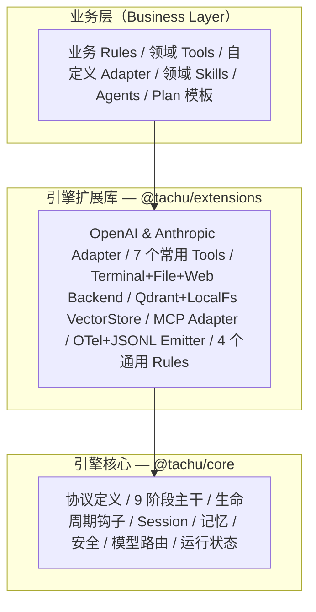
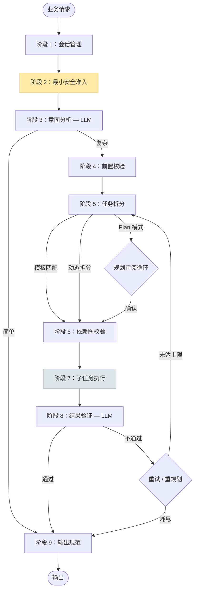

# Tachu

**正在积极开发中的 Agentic 引擎——目标是成为将任何 LLM 变为可靠、可观测 Agent 的 *Harness*。**

[](https://www.npmjs.com/package/@tachu/core)
[](#项目状态project-status)
[](#许可证license)
[](https://bun.sh)
[](https://www.typescriptlang.org)

> **⚠️ 项目状态 —— Alpha。** 9 阶段主干、Registry、Prompt 组装、CLI、OpenAI / Anthropic / Qwen Adapter、MCP Adapter、向量存储与可观测性 Emitter 已完成搭建并均有单测覆盖。**Phase 3（意图分析）已是真实 LLM 调用**，`tachu chat` / `tachu run` 会产出真实对话回复。**Phase 5（任务规划）与 Phase 8（结果验证）仍是占位实现**——被判为 *complex* 的请求暂未获得 LLM 生成的多步规划与语义校验。详见[项目状态](#项目状态project-status)与[路线图](#路线图roadmap)。**请勿用于生产**。请使用 `@alpha` dist-tag 安装。

---

## 什么是 Tachu？

**太初有道，万物之始。以声明式描述符创造 Agent 万物。**

Tachu 的目标是成为一个**你可以基于它做真实产品的 Agentic 引擎**——不是 Demo 玩具，不是 API 薄封装。它是等式 **Agent = Model + Harness** 中的 *Harness*：提供结构骨架（协议、生命周期、安全、记忆、编排），让任何 LLM 都能成为可靠、可观测的 Agent。

引擎本身刻意**不感知业务领域**——它不知道你的业务逻辑、用户身份或领域词汇。取而代之的是，它定义了一套极简的核心抽象（Rules、Skills、Tools、Agents），业务通过这些抽象注入所有智能。Tachu 被设计来处理那些真正困难的部分：9 阶段执行主干、双平面语义匹配、上下文窗口管理、精确 Token 计数的 Prompt 组装、结构化重试/降级、取消传播，以及端到端可观测性。

Tachu 以 Bun 原生 TypeScript Monorepo 形式发布，包含三个包：零依赖引擎核心（`@tachu/core`）、官方扩展库（`@tachu/extensions`），以及完整功能的 CLI 程序（`@tachu/cli`）——后者同时也是参考实现。

---

## 项目状态（Project Status）

**当前发布版本：** `1.0.0-alpha.1`（`alpha` dist-tag）

这是一次**架构骨架**发布——基础设施基本就绪，但几个依赖 LLM 的阶段仍是占位实现。下表是唯一的事实来源；README 其他位置的任何声称都必须能在这张表里找到对应。

| 能力 | 状态 | 说明 |
|-----|------|-----|
| 9 阶段主干骨架（类型、编排器、状态机、Hook 链路） | ✅ 已实现 | `packages/core/src/engine` |
| Descriptor Registry（Rules / Skills / Tools / Agents） | ✅ 已实现 | Markdown + YAML frontmatter 加载、语义索引、启动校验 |
| Prompt 组装器（tiktoken、KV Cache 友好顺序） | ✅ 已实现 | `packages/core/src/prompt` |
| 任务调度器、DAG 校验、重试/降级簿记 | ✅ 已实现 | `packages/core/src/engine/scheduler.ts` |
| Session / Memory / Runtime-state / Safety / Model-router / Provider / Observability / Hooks 八大模块 | ✅ 已实现 | `packages/core/src/modules` |
| OpenAI / Anthropic / Mock Provider Adapter | ✅ 已实现 | 流式、函数调用、工具 Schema |
| `apiKey` / `baseURL` / `organization` / `timeoutMs` 配置（env var / `tachu.config.ts` / CLI flags） | ✅ 已实现 | 支持 Azure OpenAI / LiteLLM / OpenRouter / 自建网关 |
| 7 个内置 Tools + Terminal / File / Web Backend | ✅ 已实现 | `packages/extensions/src/{tools,backends}` |
| MCP stdio + SSE Adapter | ✅ 已实现 | `packages/extensions/src/mcp` |
| `LocalFsVectorStore`（文件持久化）+ `QdrantVectorStore`（REST） | ✅ 已实现 | |
| OTel / JSONL / Console Emitter | ✅ 已实现 | |
| `tachu init` / `tachu run` / `tachu chat` CLI、流式渲染、Session 持久化、Ctrl+C 语义 | ✅ 已实现 | |
| **CLI 终端 Markdown 渲染** | ✅ **已实现** | 基于 `marked` + `marked-terminal` + `cli-highlight` 栈。作用于 `tachu chat` / `tachu run --output text` 的最终回复：TTY 环境自动开启，`NO_COLOR` / 非 TTY / `--no-color` 下自动关闭；`tachu run` 支持通过 `--markdown` / `--no-markdown` 显式开关。专用封装 `renderMarkdownToAnsi`（`packages/cli/src/renderer/markdown.ts`），附 11 个单测（`markdown.test.ts`）。 |
| **Phase 3 意图分析（LLM 调用，纯分类）** | ✅ **已实现** | 通过 `ModelRouter.resolve("intent")` 路由到已注册的 `ProviderAdapter`。该阶段为**纯分类**——`IntentResult = { complexity, intent, contextRelevance, relevantContext? }`，System Prompt 明令禁止 `directAnswer` / `answer` / `reply` 字段，面向用户的最终答复由 Phase 7 的 `direct-answer` 子流程负责。内置 **5 条 few-shot 示例**（问候 / 创造性短文 / 写代码 / 写教案 / 真正的多工具复杂任务），复杂度判定以"是否需要真实工具 / 外部资源"为准、与输出长度无关。历史窗口 ≤10 条，30s 单次超时与阶段级 Abort 信号组合控制取消。JSON 提取支持 plain / fenced / embedded 三种形态；LLM 不遵循 JSON 协议但返回了自然语言时，该文本会被截断为 `intent` 摘要（≤200 字符），并在 Phase 5 转交 `direct-answer` 子流程重新生成答复。启发式 `intent = input.slice(0, 200)` 仅在**无可用内容**时使用（Provider 未注册 / 网络 / 超时 / 取消 / 空响应）。10 个专项用例见 `intent.test.ts`。 |
| **Phase 5 任务规划（兜底契约）** | ✅ **已实现** | 强制 `plans[0].tasks.length >= 1`。规则：(1) `simple` 意图 → 单步 `direct-answer` 子流程任务；(2) `complex` + 有匹配工具 → 前 N 个工具任务；(3) `complex` + 无匹配工具 → 单步 `direct-answer` 子流程任务（携带 `warn: true`，子流程会诚实说明未命中工具）；(4) 后置守护：上游回归导致 `tasks` 为空时自动兜底。真正的 LLM-backed 多步计划生成器仍排期在后续 alpha。 |
| **`direct-answer` 内置子流程（Phase 7）** | ✅ **已实现** | `packages/core/src/engine/subflows/direct-answer.ts`。解析 `capabilityMapping.intent`（未命中时回退到 `fast-cheap`），组合 system + ≤10 条历史 + 用户 prompt，以合并后的 AbortSignal 调用 `ProviderAdapter.chat()`，单次超时 60s。System Prompt 强制**自然语言 + Markdown**、禁止 JSON 壳 / `"已识别请求：…"` 模板 / 4 空格缩进式代码块；`warn: true` 时子流程会坦诚说明"当前无匹配工具"。observability 事件统一以 `phase: "direct-answer"` 发出（`llm_call_start` / `llm_call_end`）。保留名机制：`DescriptorRegistry` 会把 `direct-answer` 列入保留名，业务侧注册 / 注销同名描述符将抛 `RegistryError.reservedName`。详见 [ADR 0001](docs/adr/decisions/0001-direct-answer-as-builtin-subflow.md)。 |
| **Phase 8 结果验证（LLM 调用）** | 🟡 **占位** | 仅检查步骤 `failed`，无语义校验。排期在后续 alpha。 |
| **Phase 9 输出装配** | ✅ **已实现** | 内容选择顺序：`taskResults['task-direct-answer']` → 结构化 `{intent, taskResults}` JSON（工具链成功路径，待 Phase 5/8 真实化后再重塑形态）→ 中文诚实回退文案（validation 未通过）。内部 state JSON 不会再外泄到用户侧。6 个专项用例见 `output.test.ts`。 |
| 真实环境端到端烟测（OpenAI / Anthropic / Azure） | 🔴 未开展 | Adapter 仅有 Mock 单测，尚未发布签署记录。 |
| 生产加固（SLO、错误预算、故障注入、签名 provenance） | 🔴 未开展 | v1 目标。 |

图例：✅ 已实现并有测试 · 🟡 骨架存在、真实实现进行中 · 🔴 未开工。

---

## 核心亮点（Key Features）

> 带「**（占位）**」标注的条目已打通端到端链路，但目前尚未触发真实 LLM 调用——请对照[项目状态](#项目状态project-status)表。

- **9 阶段执行主干** — 会话管理 → 安全准入 → 意图分析（纯分类）→ 前置校验 → 任务规划（兜底契约）→ DAG 校验 → 子任务执行 → 结果验证 **（占位）** → 输出规范；每个阶段类型安全、可挂钩，且每个请求（simple 或 complex）都会完整穿过 9 个阶段，Rules / Hooks / Observability / 预算熔断统一生效
- **`direct-answer` 内置子流程** — 对 simple 请求（以及 complex 但无匹配工具的请求），最终答复由一个引擎内置的一等公民子流程在 Phase 7 产出，不再由意图分析阶段捎带。详见 [ADR 0001](docs/adr/decisions/0001-direct-answer-as-builtin-subflow.md)。
- **双平面匹配（Dual-Plane Matching）** — 语义发现（向量相似度）+ 确定性执行闸门（Scopes、白名单、审批），作用于所有 Rules、Skills、Tools 和 Agents
- **四大核心抽象** — 以 Markdown + YAML frontmatter 描述符声明 Rules、Skills、Tools、Agents；引擎自动解析、激活并编排
- **OpenAI 与 Anthropic Adapter** — 流式、函数调用、`baseURL` / `organization` / `timeoutMs` 可配置；可对接 Azure OpenAI / LiteLLM / OpenRouter / 任意自建网关
- **MCP 集成** — 通过 `McpToolAdapter` 接入任意 MCP 服务端（stdio 或 SSE）；MCP Tools 成为引擎一等公民
- **精确 Token 计数** — 基于 tiktoken 的精确 Token 统计；KV Cache 友好的 Prompt 布局；自动上下文压缩（Head-Middle-Tail 策略）
- **结构化记忆（Memory System）** — 会话上下文窗口（含可配置上限）；压缩前强制归档；长期向量记忆召回
- **OpenTelemetry 可观测性** — 每个阶段进入/退出、LLM 调用、Tool 调用、重试和降级都产出结构化 `EngineEvent`；内置 OTel 与 JSONL Emitter
- **交互式 CLI** — `tachu chat` / `tachu run` / `tachu init`，完整参数体系、流式渲染、Session 持久化、Ctrl+C 取消传播
- **终端 Markdown 渲染** —— 最终回复由 `marked` + `marked-terminal` + `cli-highlight` 渲染；支持标题、粗体 / 斜体、列表、块引用、链接、表格、带代码高亮的 fenced code block。`NO_COLOR` / 非 TTY / `--no-color` 下自动关闭；`tachu run` 可通过 `--markdown` / `--no-markdown` 显式控制。
- **Fail-Closed 安全基线** — 循环防护、预算熔断、基础输入校验硬编码于引擎核心，不可关闭
- **Qdrant 与 LocalFs 向量存储** — 多进程部署使用 Qdrant，本地/单进程使用文件持久化

---

## 愿景（Vision）

> 太初有道，万物之始。以声明式描述符创造 Agent 万物。

Tachu 的长期愿景是成为**通用 Agent 框架**：**引擎提供骨架，业务填充血肉**——任何组织都能基于稳定、可观测、可审计的基础设施构建生产级 Agentic 系统，而无需每次从头解决安全、上下文管理、重试逻辑和多 Provider 编排等困难问题。

Tachu 基于三个核心信念：

1. **Harness 才是难点。** 模型智能已经商品化；可靠的编排机制尚未。Tachu 深度投资引擎基础设施，让应用开发者专注领域逻辑。
2. **声明优于实现（Declaration over implementation）。** Rules、Skills、Tools、Agents 均以普通 Markdown 文件声明。引擎负责解析。无框架样板代码。
3. **默认可观测。** 每个内部事件都是结构化且可发出的。生产系统需要完整 Trace——Tachu 无需额外埋点即可提供。

---

## 核心抽象（Core Abstractions）

Tachu 的四大核心抽象**平级独立、相互正交**——各自独立注册、独立激活，可在所有引擎阶段组合使用。

| 抽象 | 本质 | 激活闸门 | 作用 |
|------|------|----------|------|
| **Rules** | 约束与指导 | 语义发现 → 直接激活 | 注入各阶段 LLM System Prompt |
| **Skills** | 知识与指令 | 语义发现 → 直接激活 | 激活后注入 LLM 上下文 |
| **Tools** | 原子可执行操作 | 语义发现 → **必须过闸**（Scopes → 白名单 → 审批） | 带完整副作用追踪的执行 |
| **Agents** | 自然语言驱动的执行单元 | 语义发现 → 可激活 | 递归使用引擎能力；所有 Tool 调用仍走 Tool 闸门 |

所有四类抽象共享统一的**描述符格式**（Markdown + YAML frontmatter）：

```yaml
name: unique-name             # 必填，同类型内唯一
description: ...              # 自然语言描述（用于语义发现）
tags: [tag1, tag2]            # 标签，用于过滤和分类
trigger: { type: always }     # 激活条件
requires:
  - { kind: tool, name: read-file }  # 显式依赖引用
```

### 双平面匹配模型（Dual-Plane Matching）

每个核心抽象的激活都经历两个阶段：


- **语义发现面**：描述符的 `description` 在注册时向量化写入索引；运行时以当前上下文匹配索引，产出候选集
- **确定性执行闸门**：最终激活需通过确定性校验（显式引用、白名单/黑名单、权限 Scopes、审批检查）

Rules 和 Skills 无闸门直接激活（无副作用）。Tools 必须经过完整闸门。Agents 自由激活，但其内部调用的 Tools 仍需过 Tool 闸门。

---

## 架构总览（Architecture Overview）

### 三层发布结构



| 层级 | 包 | 职责 |
|------|----|----|
| 引擎核心 | `@tachu/core` | 协议接口、9 阶段主干骨架、8 个核心模块、Registry、Prompt 组装器、VectorStore 接口 + 内置轻量实现 |
| 扩展库 | `@tachu/extensions` | 官方具体实现：Provider Adapter、Tools、Backend、VectorStore Adapter、OTel/JSONL Emitter、通用 Rules |
| 业务/CLI | `@tachu/cli` 或业务代码 | 组装 core + extensions 为可工作的 Agent；提供领域 Rules/Skills/Tools/Agents |

### 9 阶段执行主干

每个请求都经历完整的 9 个阶段：



| # | 阶段 | LLM 调用 | 关键输出 |
|---|------|----------|---------|
| 1 | 会话管理（Session Management） | 否 | 会话上下文加载 |
| 2 | 最小安全准入（Minimum Safety Check） | 否 | 通过 / 拒绝 |
| 3 | 意图分析（Intent Analysis） | **是** | `IntentResult`（简单/复杂，上下文相关性） |
| 4 | 前置校验（Pre-Check） | 否 | 资源可用性、深度安全校验 |
| 5 | 任务拆分（Task Planning） | **是** | `PlanningResult`（带排名的方案 + DAG） |
| 6 | 依赖图校验（DAG Validation） | 否 | 环检测、节点完整性（确定性） |
| 7 | 子任务执行（Sub-task Execution） | 视子任务 | `TaskResult[]`（可并行） |
| 8 | 结果验证（Result Validation） | **是** | `ValidationResult`（通过 / 执行问题 / 拆分问题） |
| 9 | 输出规范（Output Normalization） | 否 | `EngineOutput`（含步骤状态、元信息、附件） |

**主干关键特性：**

- **全路径安全准入** — 阶段 2 对所有请求路径执行，包括简单问题的快速通道
- **上下文门卫** — 阶段 3 判断会话历史是否与本轮相关；无关历史不向下传递
- **事不过三** — 任务级重试最多 3 次（可配置）；系统级重试最多 2 次
- **取消传播（Last-message-wins）** — 同一 Session 收到新消息时，通过 `AbortController` 取消当前执行

---

## 安装（Installation）

Tachu 需要 [Bun](https://bun.sh) 作为运行时。

> **请使用 `@alpha` dist-tag 安装**（或固定到具体版本），直至 Tachu 进入稳定版。

```bash
# 安装引擎核心（alpha）
bun add @tachu/core@alpha

# 安装扩展库（Provider、Tools、Backend、向量存储）
bun add @tachu/extensions@alpha

# 全局安装 CLI
bun add -g @tachu/cli@alpha
```

安装完成后验证：

```bash
tachu --version   # 预期输出 1.0.0-alpha.1 或更新
```

---

## 快速开始（Quick Start）

### CLI 方式

```bash
# 1. 初始化项目工作空间
tachu init --template minimal --provider openai

# 2. 设置 API Key
export OPENAI_API_KEY=sk-...

# 3. 单次执行 Prompt
tachu run "帮我总结最近 5 条 git commit 的内容"

# 4. 进入交互式对话
tachu chat

# 恢复最近一次 Session
tachu chat --resume
```

### 编程式（Programmatic — TypeScript）

```typescript
import { Engine } from '@tachu/core';
import { OpenAIProviderAdapter } from '@tachu/extensions/providers';
import type { EngineConfig, InputEnvelope, ExecutionContext } from '@tachu/core';

const config: EngineConfig = {
  registry: {
    descriptorPaths: ['.tachu'],
    enableVectorIndexing: false,
  },
  runtime: {
    planMode: false,
    maxConcurrency: 4,
    defaultTaskTimeoutMs: 120_000,
    failFast: false,
  },
  memory: {
    contextTokenLimit: 8000,
    compressionThreshold: 0.8,
    headKeep: 4,
    tailKeep: 12,
    archivePath: '.tachu/archive.jsonl',
    vectorIndexLimit: 10_000,
  },
  budget: {
    maxTokens: 50_000,
    maxToolCalls: 50,
    maxWallTimeMs: 300_000,
  },
  safety: {
    maxInputSizeBytes: 1_000_000,
    maxRecursionDepth: 10,
    workspaceRoot: process.cwd(),
    promptInjectionPatterns: [],
  },
  models: {
    capabilityMapping: {
      'high-reasoning': { provider: 'openai', model: 'gpt-4o' },
      'fast-cheap':     { provider: 'openai', model: 'gpt-4o-mini' },
    },
    providerFallbackOrder: ['openai'],
  },
  observability: { enabled: true, maskSensitiveData: true },
  hooks: { writeHookTimeout: 5000, failureBehavior: 'continue' },
};

const engine = new Engine(config);
engine.useProvider(new OpenAIProviderAdapter({ apiKey: process.env.OPENAI_API_KEY! }));

const input: InputEnvelope = {
  content: '写一个 TypeScript 函数，对异步操作做防抖处理',
  metadata: { modality: 'text' },
};

const context: ExecutionContext = {
  requestId: crypto.randomUUID(),
  sessionId: 'session-001',
  traceId: crypto.randomUUID(),
  principal: { userId: 'user-001' },
  budget: { maxTokens: 20_000, maxDurationMs: 60_000 },
  scopes: ['read', 'write'],
};

for await (const chunk of engine.runStream(input, context)) {
  if (chunk.type === 'delta') process.stdout.write(chunk.content);
  if (chunk.type === 'done') console.log('\n\n完成，状态：', chunk.output.status);
}
```

---

## 包结构（Package Layout）

### 三包说明

| 包 | 说明 | 主要导出 |
|----|------|---------|
| `@tachu/core` | 零依赖引擎核心 | `Engine`、`Registry`、`PromptAssembler`、所有接口与类型 |
| `@tachu/extensions` | 官方具体实现 | `OpenAIProviderAdapter`、`AnthropicProviderAdapter`、`McpToolAdapter`、`QdrantVectorStore`、`OtelEmitter`、Backend、Tools、Rules |
| `@tachu/cli` | 生产级 CLI 程序 | `tachu chat`、`tachu run`、`tachu init` |

### 依赖关系（Dependency Relationship）


### core 包内部结构

```
@tachu/core / src/
├── types/          # 所有 TypeScript 接口：描述符、上下文、I/O、配置
├── engine/         # Engine 入口类、各阶段处理器、编排控制面、依赖调度器
├── registry/       # Registry：注册/查询/启动校验（四类抽象统一管理）
├── modules/        # 8 个核心模块（会话、记忆、运行状态、模型路由、
│                   #   Provider、安全、可观测性、Hooks）
├── prompt/         # PromptAssembler：Token 预算分配、KV Cache 友好排列
└── vector/         # VectorStore 接口 + 内置轻量实现
```

---

## Provider 与集成（Providers & Integrations）

### LLM Provider

| Provider | 包 | 流式输出 | Function Calling | 备注 |
|----------|----|----|------|------|
| OpenAI | `@tachu/extensions/providers` | ✅ | ✅ | GPT-4o、GPT-4o-mini 及所有可枚举模型 |
| Anthropic | `@tachu/extensions/providers` | ✅ | ✅ | Claude 3.5 Sonnet 及所有可枚举模型 |
| Mock | `@tachu/extensions/providers` | ✅ | ✅ | 测试专用；可配置响应内容 |

通过 `models.providerFallbackOrder` 配置降级顺序。系统级错误（超时、API 报错）时，引擎自动按顺序切换 Provider，无需重新规划。

### Provider 连接配置

内置 Provider 均支持 `apiKey`、`baseURL`、`organization`（仅 OpenAI）、`project`（仅 OpenAI）、`timeoutMs`。共有三种注入途径（优先级从低到高）：

1. **环境变量**（推荐用于密钥）：

   | 变量 | Provider | 用途 |
   |------|----------|------|
   | `OPENAI_API_KEY` | OpenAI | 未显式设置 `apiKey` 时的回退凭据 |
   | `OPENAI_BASE_URL` | OpenAI | SDK 原生支持的 baseURL 覆盖 |
   | `ANTHROPIC_API_KEY` | Anthropic | 未显式设置 `apiKey` 时的回退凭据 |
   | `ANTHROPIC_BASE_URL` | Anthropic | SDK 原生支持的 baseURL 覆盖 |

2. **`tachu.config.ts` 的 `providers` 段**（推荐用于非密钥类连接元信息）：

   ```typescript
   const config: EngineConfig = {
     // ...其它字段
     providers: {
       openai: {
         // apiKey 建议继续走环境变量，保持配置文件可提交
         baseURL: 'https://your-gateway.example.com/v1',
         organization: 'org-xxxx',
         timeoutMs: 60_000,
       },
       anthropic: {
         baseURL: 'https://your-gateway.example.com/anthropic',
         timeoutMs: 60_000,
       },
     },
   };
   ```

3. **CLI 命令行参数**（优先级最高，适合一次性覆盖）：

   ```bash
   tachu run "..." --provider openai \
     --api-base https://gateway.example.com/v1 \
     --api-key sk-dev \
     --organization org-xxxx

   tachu chat --provider anthropic \
     --api-base https://gateway.example.com/anthropic
   ```

   CLI flag 始终作用于本次请求实际选中的 Provider（显式 `--provider` 或 `capabilityMapping` 解析结果），对 `mock` provider 不生效。

典型用途：Azure OpenAI、自建 LiteLLM/OpenRouter/Kong 网关、企业出口代理、离线内网部署。

### MCP（Model Context Protocol）

Tachu 官方提供两种 MCP transport 的 Adapter（`McpStdioAdapter` / `McpSseAdapter`，基于 `@modelcontextprotocol/sdk`），并在 CLI 层把它们连接到 `DescriptorRegistry` 与 `TaskExecutor`——你只需在 `tachu.config.ts` 里声明一段 `mcpServers`，CLI 会自动发现工具、路由调用、在进程退出时断连。

**CLI 声明式配置（推荐，字段命名对齐 OpenAI Agents SDK 与通用 MCP 客户端约定）**

```typescript
// tachu.config.ts
const config: EngineConfig = {
  // ... 其他字段
  mcpServers: {
    // 本地 stdio 进程（标准 MCP stdio 传输）
    fs: {
      command: 'npx',
      args: ['-y', '@modelcontextprotocol/server-filesystem', process.cwd()],
      env: { ...process.env },
    },
    // 远端 SSE 服务（标准 MCP SSE 传输）
    remoteKb: {
      url: 'https://mcp.example.com/sse/',
      headers: { Authorization: `Bearer ${process.env.MCP_TOKEN ?? ''}` },
      timeoutMs: 50_000,        // 单次工具调用超时
      connectTimeoutMs: 10_000, // 握手阶段超时
      // 可选（tachu 扩展字段）
      // description: '项目文档检索示例接口',
      // keywords: ['文档', 'docs'],
      // expandOnKeywordMatch: true,
      // allowTools: ['getStatus'],
      // denyTools: ['dangerousOp'],
      // requiresApproval: true,
      // disabled: false,
      // tags: ['example'],
    },
  },
};
```

行为要点：

- **命名空间**：远端工具以 `<serverId>__<原工具名>`（例如 `remoteKb__getStatus`）形态注册到 `DescriptorRegistry`，对 LLM 可见，多 server 共存互不冲突
- **失败隔离**：任何一个 server 连接 / listTools 失败只在 stderr 打一行警告，不阻塞其余 server 与主流程
- **超时 & 取消**：`adapter.connect()` 受 `connectTimeoutMs` 保护；`ToolExecutionContext.abortSignal` 透传到 `adapter.executeTool({ signal })`，Ctrl+C / 预算熔断能沿着协议层传播到 MCP 服务端
- **审批闸门**：MCP 工具 `requiresApproval` 与工具自身 / server 级 `requiresApproval` 做逻辑 OR；与 CLI 的默认 `y/N` 审批提示一致
- **生命周期**：进程退出前 `tachu run` / `tachu chat` 都会 `engine.dispose()` 后调用 `mounted.disconnectAll()`，幂等；失败的 disconnect 只 emit warning
- **server 级 `description`（LLM 路由提示）**：若声明，装配时会自动拼到该 server 每个工具的 `description` 前（形如 `[<serverId>: <description>] <原 description>`），让规划阶段即便不读完整 JSON schema 也能判断工具归属
- **按关键词惰性暴露工具（压缩 prompt）**：`expandOnKeywordMatch: true` 且 `keywords` 非空的 server，启动时**不会**把工具注册到 Registry；`tachu run <prompt>` 会按本次 prompt、`tachu chat` 会按每轮 `you>` 输入做一次子串大小写不敏感匹配（结构化输入先 `JSON.stringify`），命中任一 keyword 才注册该 server 的工具，未命中则从 Registry 移除。适合 MCP server 暴露几十个工具但常规对话用不上的场景；schema 会拒绝 `expandOnKeywordMatch=true` 但 `keywords` 空缺的配置

**SDK 直用（绕过 CLI，自行组装时）**

```typescript
import { McpSseAdapter, McpStdioAdapter } from '@tachu/extensions';

// 远端 SSE
const sse = new McpSseAdapter({
  url: 'https://mcp.example.com/sse/',
  serverId: 'remoteKb',
  headers: { Authorization: 'Bearer ...' },
  defaultTimeoutMs: 50_000,
});
await sse.connect('https://mcp.example.com/sse/');
const tools = await sse.listTools();
for (const tool of tools) await engine.registry.register(tool);

// 本地 stdio
const stdio = new McpStdioAdapter({
  command: 'npx',
  args: ['-y', '@modelcontextprotocol/server-filesystem', process.cwd()],
  serverId: 'fs',
});
await stdio.connect('');
```

若你在自定义宿主里同样想要 CLI 的"一行配置自动装配"体验，可以直接复用
`@tachu/cli` 导出的 `mountMcpServers(config.mcpServers, { cwd })` / `setupMcpServersFromConfig(config, registry, { cwd })`——它们返回 `{ descriptors, executors, disconnectAll }`，把 `executors` 合并进 `createEngine({ extraToolExecutors })` 即可。

### 向量存储（Vector Stores）

| Adapter | 包 | 适用场景 |
|---------|----|----|
| `InMemoryVectorStore` | `@tachu/core` | 开发/测试；零依赖内置实现 |
| `LocalFsVectorStore` | `@tachu/extensions/vector` | 单进程生产；文件持久化 |
| `QdrantVectorStore` | `@tachu/extensions/vector` | 多进程生产；完整 Qdrant REST API |

```typescript
import { QdrantVectorStore } from '@tachu/extensions/vector';

const vectorStore = new QdrantVectorStore({
  url: 'http://localhost:6333',
  collectionName: 'tachu-descriptors',
});
engine.useVectorStore(vectorStore);
```

### 可观测性 Emitter

| Emitter | 包 | 输出目标 |
|---------|----|----|
| `OtelEmitter` | `@tachu/extensions/emitters` | OpenTelemetry Span（via `@opentelemetry/api`） |
| `JsonlEmitter` | `@tachu/extensions/emitters` | 追加写入 JSONL 文件 |
| `ConsoleEmitter` | `@tachu/extensions/emitters` | 结构化控制台输出（开发用） |

### 执行 Backend

| Backend | 包 | 说明 |
|---------|----|----|
| `TerminalBackend` | `@tachu/extensions/backends` | 沙箱终端内的 Shell 命令执行 |
| `FileBackend` | `@tachu/extensions/backends` | 文件系统读写 |
| `WebBackend` | `@tachu/extensions/backends` | HTTP 请求至外部 API / Web 资源 |

---

## 设计原则（Design Principles）

Tachu 基于七条核心工程原则：

1. **双平面匹配** — 所有四类核心抽象通过语义方式发现（向量相似度），但通过确定性方式激活（Scopes、白名单、审批）。语义发现是参考；执行闸门是权威。

2. **全路径安全准入** — 最小安全检查（阶段 2）对*所有*请求路径执行，包括简单问题的快速通道。安全性绝不为性能让步。

3. **事不过三** — 任务级重试循环和系统级重试循环都有严格上限。不允许无限重试。耗尽上限后，引擎输出步骤级完成状态而非笼统失败。

4. **KV Cache 友好的 Prompt 组装** — System Prompt 按稳定顺序组装（硬约束 Rules → 软偏好 Rules → Skills → Tool 定义），使跨轮次的前缀保持不变，最大化 KV Cache 复用，降低 LLM 成本。

5. **取消传播（Last-message-wins）** — 同一 Session 收到新消息时，通过 `AbortController` 取消当前执行，在已有上下文基础上处理新输入。保证上下文连贯，避免无效工作。

6. **引擎不感知业务权限** — 引擎只在 Tool 执行闸门处校验执行上下文中的粗粒度 `scopes`。细粒度业务授权由 Tool 实现本身或专用的授权 Tool 负责。

7. **Fail-Closed 安全基线** — 循环防护、预算熔断、基础输入校验硬编码于引擎核心，*不可*通过配置禁用。即使业务配置完全为空，引擎也不会失控运行。

---

## 配置（Configuration）

引擎通过项目根目录的 `tachu.config.ts` 文件配置（由 `tachu init` 自动生成）：

```typescript
import type { EngineConfig } from '@tachu/core';

const config: EngineConfig = {
  // 描述符注册中心：Rules/Skills/Tools/Agents 加载路径
  registry: {
    descriptorPaths: ['.tachu'],
    enableVectorIndexing: false,       // 设置 true 可在启动时把 descriptor 自动写入向量索引
  },

  // 运行时行为
  runtime: {
    planMode: false,                   // true 时只规划不执行任务
    maxConcurrency: 4,                 // 最大并行子任务数
    defaultTaskTimeoutMs: 120_000,     // 单个任务默认超时（ms）
    failFast: false,                   // 任意子任务失败立即中止整次运行
  },

  // 上下文窗口与记忆
  memory: {
    contextTokenLimit: 8000,           // 上下文窗口 Token 上限
    compressionThreshold: 0.8,         // 达到 80% 容量时触发压缩
    headKeep: 4,                       // 压缩时保留的最早消息条数
    tailKeep: 12,                      // 压缩时保留的最新消息条数
    archivePath: '.tachu/archive.jsonl',
    vectorIndexLimit: 10_000,          // 内置向量索引最大条目数
  },

  // 预算约束（每次执行）
  budget: {
    maxTokens: 50_000,                 // 单次执行总 Token 预算
    maxToolCalls: 50,                  // 单次执行最大 Tool 调用次数
    maxWallTimeMs: 300_000,            // 5 分钟墙钟时间上限
  },

  // 安全基线（硬编码最小集；通过 SafetyModule.registerPolicy 追加业务策略）
  safety: {
    maxInputSizeBytes: 1_000_000,
    maxRecursionDepth: 10,
    workspaceRoot: process.cwd(),      // 文件后端根目录（用于路径遍历防护）
    promptInjectionPatterns: [],       // 可选：注入告警的正则字符串；命中只报 warning
  },

  // 模型路由
  models: {
    capabilityMapping: {
      'high-reasoning': { provider: 'openai', model: 'gpt-4o' },
      'fast-cheap':     { provider: 'openai', model: 'gpt-4o-mini' },
      'vision':         { provider: 'openai', model: 'gpt-4o' },
    },
    providerFallbackOrder: ['openai', 'anthropic'],
  },

  // 可观测性（事件经 ObservabilityEmitter 发出）
  observability: {
    enabled: true,
    maskSensitiveData: true,           // 自动脱敏 PII
  },

  // Hooks
  hooks: {
    writeHookTimeout: 5_000,           // ms；可写 Hook 超时即跳过
    failureBehavior: 'continue',       // 'abort' 表示任意 Hook 失败即整次运行失败
  },
};

export default config;
```

所有字段均有合理默认值。`tachu init` 会根据你选择的 Provider 预填生成此文件。

> **Schema 参考**：完整的 `EngineConfig` 类型与 v1 vs 历史草案差异说明，详见 detailed-design §14.1。早期使用 `retry / planning / agent / context / execution / storage` 顶级键的草案已废弃，运行时会被 `validateConfig` 拒绝并抛出 `VALIDATION_INVALID_CONFIG`。

---

## CLI 参考（CLI Reference）

### `tachu init`

初始化 Tachu 项目工作空间。

```
tachu init [options]

选项：
  --template <name>    脚手架模板：minimal | full  （默认：minimal）
  --force              已存在时强制覆盖（不询问）
  --path <dir>         目标目录                   （默认：当前目录）
  --provider <name>    写入 config 的默认 Provider：openai | anthropic | mock  （默认：mock）
  --no-examples        跳过生成示例 Rule / Tool 描述符
  -h, --help           显示帮助
```

生成 `.tachu/` 目录骨架 + `tachu.config.ts` + `.gitignore` 追加条目。

---

### `tachu run <prompt>`

单次执行 Prompt，将结果流式输出到 stdout。

```
tachu run <prompt> [options]

参数：
  <prompt>             Prompt 文本（或通过 stdin 管道传入）

选项：
  --session <id>          指定 Session ID
  --resume                恢复最近一次 Session
  --model <name>          覆盖 high-reasoning 模型
  --provider <name>       覆盖默认 Provider
  --api-base <url>        覆盖 provider baseURL（网关 / Azure / LiteLLM 场景）
  --api-key <key>         覆盖 provider apiKey（生产环境建议走环境变量）
  --organization <id>     覆盖 OpenAI organization ID
  --input <file>          从文件读取 Prompt
  --json                  将 Prompt 解析为 JSON（结构化输入）
  --output <fmt>          输出格式：text | json | markdown  （默认：text）
  --markdown              在 --output text 下启用终端 Markdown 渲染
                          （默认：stdout 是 TTY 且未设 NO_COLOR 时开启）
  --no-markdown           关闭终端 Markdown 渲染（强制输出原始文本）
  --no-validation         跳过阶段 8 结果验证
  --plan-mode             启用 Plan 模式（阶段 5 后暂停等待审批）
  --verbose, -v           详细日志（phase 切换；每个 phase 尾部自动附 `(Nms)` 耗时）
  --debug                 调试模式：隐含 --verbose，并把引擎 observability 事件
                          （phase / llm / tool / MCP）按颜色分类打到 stderr。
                          对 `-o json` 管道安全（不污染 stdout）
  --no-color              禁用 ANSI 彩色输出（同 NO_COLOR 环境变量；
                          由于 Markdown 渲染依赖彩色输出，此选项同时隐含 --no-markdown）
  --timeout <ms>          墙钟时间上限（覆盖 budget.maxWallTimeMs）
  -h, --help              显示帮助
```

---

### `tachu chat`

进入多轮交互式对话 Session。

```
tachu chat [options]

选项：
  --session <id>          指定 Session ID
  --resume                恢复最近一次 Session
  --history               列出所有 Session 后退出（不进入交互）
  --export <file>         将指定 Session 导出为 Markdown 后退出
  --model <name>          覆盖 high-reasoning 模型
  --provider <name>       覆盖默认 Provider
  --api-base <url>        覆盖 provider baseURL（网关 / Azure / LiteLLM 场景）
  --api-key <key>         覆盖 provider apiKey（生产环境建议走环境变量）
  --organization <id>     覆盖 OpenAI organization ID
  --plan-mode             启用 Plan 模式
  --verbose, -v           详细日志（phase 尾部带 `(Nms)` 耗时）
  --debug                 调试模式：隐含 --verbose，把 observability 事件打到 stderr，
                          并在每轮输入时打印 MCP gated group 的激活/注销摘要
  --no-color              禁用彩色输出
  -h, --help              显示帮助
```

**交互内置命令**（输入时以 `/` 开头）：

| 命令 | 说明 |
|------|------|
| `/exit` | 保存 Session 并退出 |
| `/reset` | 清空当前 Session 的 Memory |
| `/new` | 开启新 Session |
| `/list` | 列出所有已保存的 Session |
| `/load <id>` | 切换到指定 Session |
| `/save` | 手动持久化当前 Session |
| `/export <path>` | 将当前 Session 导出为 Markdown 文件 |
| `/history` | 显示本 Session 的消息历史 |
| `/stats` | 显示 Token 用量、Tool 调用次数、剩余预算 |
| `/help` | 显示所有命令 |

**Ctrl+C 行为：**
- 第一次：取消当前 LLM/Tool 调用（回到提示符，Session 不丢失）
- 1 秒内第二次：保存 Session 并正常退出
- 第三次：强制退出

**Session 持久化契约：**

`tachu chat` 默认使用 `@tachu/extensions` 提供的 `FsMemorySystem`。每次 `append` 时会把消息写入 `<cwd>/.tachu/memory/<session-id>.jsonl`（append-only，崩溃安全）。`--resume` 与 `--session <id>` 在启动时一次性从该文件 hydrate 全部历史，之后 engine 继续在同一个 `MemorySystem` 中运行——LLM 会看到完整的前置上下文。

- 通过 `tachu.config.ts` 中的 `memory.persistence` 开关控制（默认 `"fs"`；SDK 嵌入场景可用 `"memory"`）
- `persistDir` 默认 `.tachu/memory`
- 旧版 session 文件（`messages` 内嵌于 session JSON 里）在首次 resume 时自动迁移到新的 jsonl 布局（一次性、幂等）
- `/history`、`/export <path>`、`/stats`、`/reset`、`/clear`、`/new`、`/load <id>` 均以此唯一权威源为准

---

## 扩展指南（Extension Guide）

Tachu 通过在 `.tachu/` 目录下创建 Markdown 描述符文件来扩展。Rules、Skills 和 Tools 无需任何代码变更——只有 Agent 的执行函数需要在代码中单独注册。

### 自定义 Rule

```markdown
<!-- .tachu/rules/no-external-calls.md -->
---
name: no-external-calls
description: 禁止 Agent 在未获明确审批前发起外部网络调用
type: rule
scope: [execution]
tags: [security, network]
---

除非被调用 Tool 的 requiresApproval 为 true 且用户已确认，
否则不得发起 HTTP 请求、DNS 查询或任何其他外部网络调用。
```

### 自定义 Skill

```markdown
<!-- .tachu/skills/git-workflow/SKILL.md -->
---
name: git-workflow
description: 本仓库 Git 分支策略、Commit 规范与 PR 工作流知识
tags: [development, git]
requires:
  - { kind: tool, name: run-command }
---

## Git 工作流

本仓库采用基于主干的开发模式（trunk-based development），配合短生命周期特性分支。

### 分支命名
- 功能分支：`feat/<ticket>-<short-desc>`
- 修复分支：`fix/<ticket>-<short-desc>`

### Commit 规范
使用 Conventional Commits：`type(scope): subject`
...
```

### 自定义 Tool

```markdown
<!-- .tachu/tools/query-db.md -->
---
name: query-db
description: 对应用数据库执行只读 SQL 查询
sideEffect: readonly
idempotent: true
requiresApproval: false
timeout: 10000
inputSchema:
  type: object
  properties:
    sql:   { type: string, description: "SQL SELECT 语句" }
    limit: { type: number, description: "最大返回行数", default: 100 }
  required: [sql]
execute: queryDatabase
---

执行参数化只读 SQL 查询，结果以 JSON 数组形式返回。
```

在 `engine-factory.ts` 中注册执行函数：

```typescript
engine.registry.registerExecutor('queryDatabase', async (input, ctx) => {
  const { sql, limit = 100 } = input as { sql: string; limit?: number };
  return db.query(sql).limit(limit).execute();
});
```

### 自定义 Agent

```markdown
<!-- .tachu/agents/code-reviewer.md -->
---
name: code-reviewer
description: 审查 Pull Request diff，产出结构化代码审查意见
sideEffect: readonly
idempotent: true
requiresApproval: false
timeout: 180000
maxDepth: 1
availableTools: [read-file, search-code, run-command]
---

你是一名严谨的代码审查者。接到 diff 或文件集后：
1. 理解变更意图
2. 从正确性、清晰度、安全性和性能角度逐项审查
3. 输出带有严重程度分级的结构化审查意见：critical / major / minor / nit
```

---

## 可观测性与安全（Observability & Safety）

### OpenTelemetry 集成

每个引擎事件映射为一条 OTel Span，实现完整的分布式追踪：

```typescript
import { OtelEmitter } from '@tachu/extensions/emitters';
import { NodeTracerProvider } from '@opentelemetry/sdk-trace-node';
import { SimpleSpanProcessor } from '@opentelemetry/sdk-trace-base';
import { OTLPTraceExporter } from '@opentelemetry/exporter-trace-otlp-http';

const provider = new NodeTracerProvider();
provider.addSpanProcessor(
  new SimpleSpanProcessor(new OTLPTraceExporter({ url: 'http://localhost:4318/v1/traces' }))
);
provider.register();

engine.useEmitter(new OtelEmitter());
```

**每次请求产出的事件类型：**

| 事件类型 | 时机 |
|---------|------|
| `phase_enter` / `phase_exit` | 每个流程阶段进入/退出 |
| `llm_call_start` / `llm_call_end` | 每次 LLM 调用 |
| `tool_call_start` / `tool_call_end` | 每次 Tool 执行 |
| `retry` | 任务级或系统级重试触发 |
| `provider_fallback` | Provider 降级启动 |
| `budget_warning` | 预算已用到上限的 80% |
| `budget_exhausted` | 预算熔断激活 |
| `error` | 任何 `EngineError` 子类 |

### 安全模块（Safety Module）

安全模块分两层独立运行：

**引擎固有基线（不可禁用）：**
- 输入大小上限（`maxInputSize` 字节）
- 递归深度限制（`maxRecursionDepth`）
- 预算熔断（Token/时间预算耗尽时立即终止）

**业务可注入策略**（通过 Hooks 或配置）：
- Prompt 注入检测（`enablePromptInjectionCheck: true`）
- 敏感操作拦截（通过 `engine.registerSafetyPolicy()` 注册）
- 输出内容合规检查

```typescript
// 注册自定义安全策略
engine.registerSafetyPolicy(async (input, ctx) => {
  if (containsPersonalData(input.content)) {
    return { passed: false, violations: [{ type: 'pii', message: '输入中检测到个人隐私数据' }] };
  }
  return { passed: true, violations: [] };
});
```

### 兜底与用户可见契约（Graceful Degradation Policy）

Tachu 保证 **用户看到的每一次响应都是可读的自然语言答复** —— 引擎绝不返回孤零零的 "failed"，也不会把内部步骤 ID / Phase 编号 / 子流程名泄漏给终端用户。这由三道防线共同保证：

1. **源头**：所有 `EngineError` 自带 `userMessage` 字段，由中文模板表解析（覆盖 46 个错误码）；对 UI 暴露的 `toUserFacing()` 投影只返回 `{ code, userMessage, retryable }`，不含 `message` / `stack` / `cause` / `context`。
2. **聚合**：当 `validation.passed === false` 且内置 `direct-answer` 子流程也未产出时，Phase 9 的 `ensureFallbackText()` 先尝试一次 best-effort LLM 摘要（5 秒超时 / 0 重试），失败静默降级到本地确定性模板。返回文本始终 **≥ 30 字**、带可执行下一步、且已过脱敏。
3. **最终屏蔽**：CLI `StreamRenderer` 对所有面向用户的字符串（`finalize(text|markdown)` + `error` chunk）过一遍正则黑名单（`sanitizeUserText`），兜住任何上游漏过的内部术语。

契约由 `packages/core/src/engine/phases/fallback-contract.test.ts` 强制执行（55 条断言）。任何把 `task-tool-N` / `Phase N` / `direct-answer 子流程` / `capability 路由` / `Tool / Agent 描述符` 泄漏到用户可见路径的回归，都会让 CI 变红。

---

## 发展路线（Roadmap）

Tachu 按 `1.0.0-alpha.n` → `1.0.0-beta.n` → `1.0.0` 三条通道演进。下面每个里程碑都对应真实、可发布、有测试的交付物，不是愿望清单。

### 1.0.0-alpha.1 —— 首个公开 alpha（当前）

- [x] 9 阶段主干、Registry、Prompt 组装、调度器、8 个核心模块
- [x] OpenAI / Anthropic / Qwen / Mock Provider Adapter，`apiKey` / `baseURL` / `organization` / `timeoutMs` 可通过 env、`tachu.config.ts` 或 CLI flag 配置
- [x] CLI（`tachu init` / `run` / `chat`）流式渲染、Session 持久化、双击 Ctrl+C 退出、终端 Markdown 渲染
- [x] MCP stdio + SSE Adapter，按 `tachu.config.ts` 自动装配
- [x] 向量存储（`LocalFsVectorStore`、`QdrantVectorStore`）+ 可观测性 Emitter（OTel / JSONL / Console）
- [x] `direct-answer` 内置子流程 —— 在 Registry 保留名机制下于 Phase 7 驱动面向用户的 LLM 回复，与普通子流程共享同一套安全与可观测钩子
- [x] `tool-use` 内置子流程 —— 完整的 Agentic Loop：工具选择、审批、执行、反馈、终止
- [x] Phase 3（意图分析）真实 LLM 调用：结构化 JSON Schema、few-shot 示例、有界历史窗口、组合超时
- [x] Phase 5 兜底契约 —— 任何请求路径都保证 `plans[0].tasks.length >= 1`；LLM-backed 排序规划器排期在后续 alpha
- [x] Phase 9 输出装配 —— 内部 state JSON 不会外泄
- [x] 可选的 `@tachu/web-fetch-server` Sidecar —— 支撑 `web-fetch` / `web-search` 工具，SDK 不引入浏览器依赖
- [x] 结构化文生图契约（`ChatResponse.images` / `EngineOutput.metadata.generatedImages`）与 `tachu run --save-image`

### 后续 alpha 迭代

- [ ] LLM-backed Phase 5 规划器：为 tool-chain 场景产出排序多步计划
- [ ] Phase 8 真实 LLM 调用：结构化 `ValidationResult` 驱动重试 / 重新规划循环
- [ ] `tachu run --plan-mode` 真实 Plan 预览
- [ ] 引擎级 `delta` 流，使 CLI 在 Phase 3 / 7 / 8 能做 Token-by-Token 渲染
- [ ] `tachu run --json` 输出 Schema 锁定
- [ ] 故障注入测试框架
- [ ] 端到端烟测记录存档至 `docs/smoke/`

### 1.0.0-beta —— 毕业标准

- [ ] 连续两个 alpha 版本无回退
- [ ] 至少有 1 位第三方用户对真实 LLM 完整跑通并反馈
- [ ] 公开覆盖率与基准性能基线
- [ ] 公开自 `1.0.0-alpha.1` 以来所有 Breaking Change 的升级指南
- [ ] 在稳定协议背后引入更多 Provider Adapter（Gemini、Mistral）

### 1.0.0 —— 稳定

- [ ] SLO / 错误预算文档
- [ ] 签名发布 provenance
- [ ] 向后兼容策略
- [ ] 生产部署案例文档

### 1.0 之后 —— 愿景

- 多 Agent 协作（Agent 间通信协议）
- 跨部署重启的长期记忆持久化
- 子任务粒度的精细预算分配
- 更多 VectorStore Adapter（Pinecone、pgvector）
- Plan 模板库
- 更多压缩策略

---

## 贡献指南（Contributing）

### 环境要求

- [Bun](https://bun.sh) >= 1.1.0
- TypeScript 5.x（通过 devDependencies 提供）

### 开发工作流

```bash
# 克隆并安装
git clone https://github.com/dangaogit/tachu.git
cd tachu
bun install

# 运行所有测试
bun test

# 类型检查
bun run typecheck

# 构建所有包
bun run build

# 运行指定包的测试
bun test --filter packages/core
```

### 项目规范

- 文件名：`kebab-case`
- 类名/类型名：`PascalCase`
- 函数/变量名：`camelCase`
- 常量名：`SCREAMING_SNAKE_CASE`
- 所有公开 API 必须有 TSDoc 注释（`@param`、`@returns`、`@throws`、`@example`）
- 测试文件与源码同目录，命名 `*.test.ts`
- 集成测试放 `__tests__/`

Pull Request 要求：
- 所有测试通过（`bun test`）
- TypeScript 零错误（`bun run typecheck`）
- 覆盖率达标（行 ≥80%，分支 ≥70%）
- 新增公开 API 有完整 TSDoc

详见 `CONTRIBUTING.md`。

---

## 基准测试（Benchmarks）

性能基准位于 `packages/core/benchmarks/`，通过 `bun test` 执行：

| 基准 | 度量指标 | 基线数据 |
|------|---------|---------|
| `scheduler.bench.ts` — 100 个并行任务 | 调度吞吐量 | *由 verifier 阶段填充* |
| `vector-store.bench.ts` — 10,000 条索引，topK=10 | 搜索 QPS | *由 verifier 阶段填充* |
| `prompt-assembler.bench.ts` — 4K Token 窗口组装 | 组装延迟（p99） | *由 verifier 阶段填充* |

基准测试提供回归检测基线；v1 不设定最低性能指标要求。

---

## 文档（Documentation）

| 文档 | 说明 |
|------|------|
| [架构设计（Architecture Design）](./docs/adr/architecture-design.md) | 愿景、三层结构、四大核心抽象、9 阶段主干设计 |
| [详细设计（Detailed Design）](./docs/adr/detailed-design.md) | TypeScript 接口、模块规格、配置 Schema |
| [技术设计（Technical Design）](./docs/adr/technical-design.md) | 技术选型、工程结构、实现指南 |

---

## Web Fetch Server（可选）

**Web Fetch Server**（`@tachu/web-fetch-server`）是可选的 HTTP 侧车服务，为 `@tachu/extensions` 中的 `web-fetch` / `web-search` 工具提供远端浏览器渲染与结构化页面抽取。它**不会**随引擎或 CLI 默认启动——仅在需要针对线上页面使用上述工具时再单独运行。

### 快速启动（仓库根目录）

```bash
bun install
bun run dev:server:install-browser   # 首次：为 Playwright 安装 Chromium
bun run dev:server
```

### 工具说明

- **`web-fetch`** — 通过服务端拉取 URL，并返回面向 LLM 的 Markdown（Readability + Turndown 管线）。
- **`web-search`** — v0.1 仅为 **stub**，尚未接入真实搜索 Provider。

完整环境变量、安全默认（例如未配置 token 时仅绑定 `127.0.0.1`）与生产/Docker 说明见 [packages/web-fetch-server/README.md](./packages/web-fetch-server/README.md)。

---

## 许可证（License）

[Apache License 2.0](./LICENSE) © 2026 Tachu Contributors

本项目采用 Apache License 2.0 许可证发布。许可证全文见 [LICENSE](./LICENSE) 文件，也可在 <http://www.apache.org/licenses/LICENSE-2.0> 获取。

除非适用法律要求或书面同意，按照本许可证分发的软件是按"原样"分发的，不附带任何明示或暗示的担保或条件。请参阅许可证以了解特定语言的管理权限和限制。
