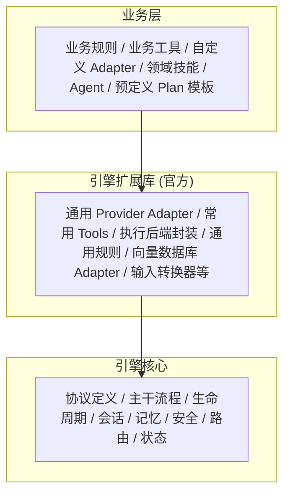
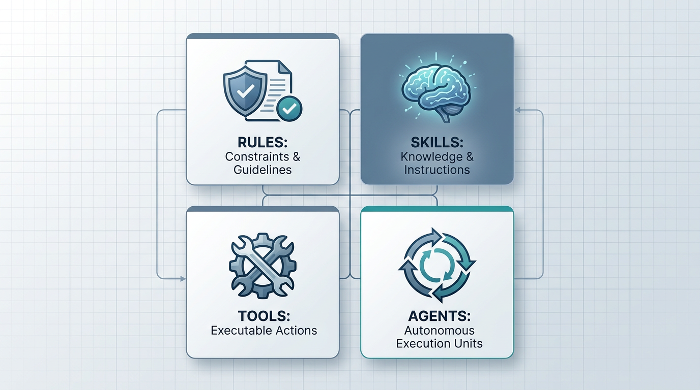
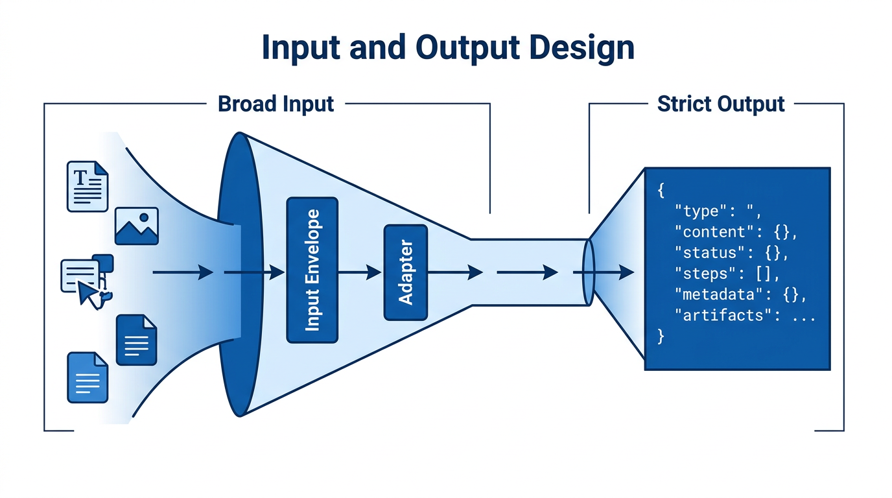
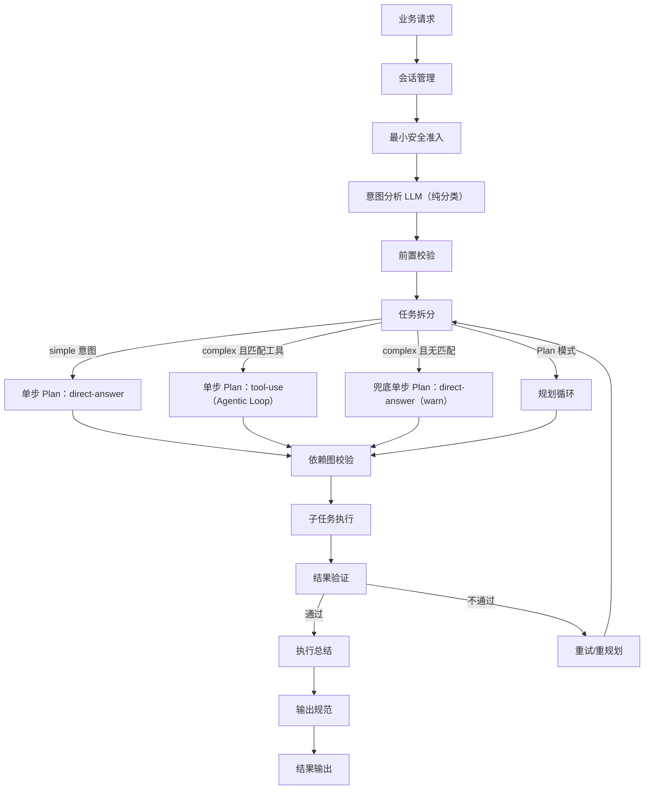
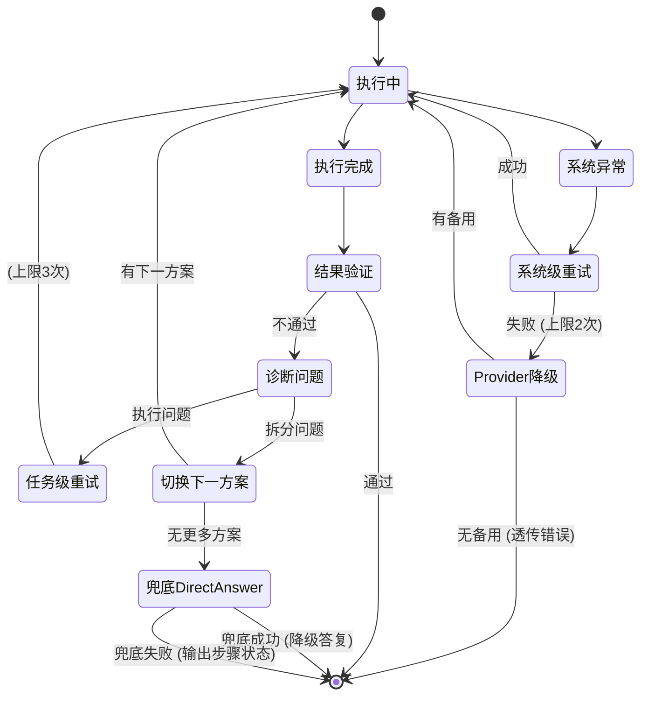
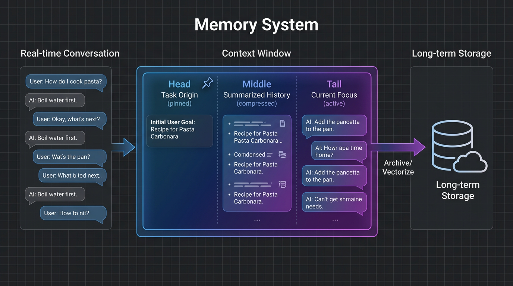
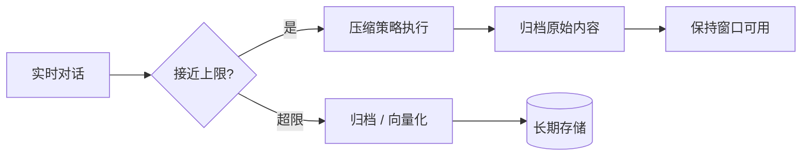

# Agentic Engine 架构设计文档

> 状态：架构提案（基于三轮评审修订） 最后更新：2026-04-16

---

## 一、项目定位

Agentic Engine 是一个**通用的 Agent 框架引擎**（本质是
Harness）。引擎自身不包含过多实际功能，只负责定义和约束整体架构核心，确保上层业务可以快速接入。

- 引擎提供骨架（协议、流程、生命周期），业务填充血肉（规则、工具、技能、领域逻辑）
- 适用领域不限：ToB、ToC、代码生成等，引擎本身具备通用性
- 引擎只与上层业务打交道，不感知终端用户的概念
- Agent = Model + Harness，引擎就是 Harness

---

## 二、三层发布结构



```
┌─ 业务层 ──────────────────────────────────────────────────┐
│  业务规则、业务工具、自定义 Adapter、领域技能、Agent、        │
│  预定义 Plan 模板                                             │
├─ 引擎扩展库（官方）──────────────────────────────────────────┤
│  通用 Provider Adapter、常用 Tools、执行后端封装、            │
│  通用规则、向量数据库 Adapter、输入转换器等                   │
├─ 引擎核心 ────────────────────────────────────────────────────┤
│  协议定义、主干流程、生命周期、会话、记忆、安全、路由、状态   │
└──────────────────────────────────────────────────────────────┘
```

- **引擎核心**：协议、流程骨架、生命周期，不含具体实现
- **引擎扩展库**：官方提供的通用实现（Provider
  Adapter、Tools、执行后端、向量数据库 Adapter 等）
- **业务层**：基于核心 + 扩展库构建领域应用

---

## 三、四大核心抽象



引擎中有 4 个可注册的核心概念，**平级独立，贯穿全引擎**：

| 概念       | 本质                   | 作用域                           |
| ---------- | ---------------------- | -------------------------------- |
| **Rules**  | 约束与指导             | 注入 LLM 各阶段                  |
| **Skills** | 知识与指令             | 注入 LLM 上下文                  |
| **Tools**  | 原子可执行操作         | 任务执行阶段调用                 |
| **Agents** | 自然语言驱动的执行单元 | 递归使用引擎能力，动态创建子任务 |

### 共享特性

- **最小公共元信息**：所有概念共享以下公共字段

  ```yaml
  name: 唯一标识
  description: 自然语言描述（用于语义发现）
  tags: 标签（用于过滤和分类）
  trigger: 激活条件
  requires: 显式依赖引用
  ```

  各概念在此基础上扩展**类型专属字段**（见各概念详细说明）。

- **双平面匹配模型**：

  引擎对核心抽象的激活采用"发现"与"执行"分离的双平面机制：


- **语义发现面**：基于 description
  向量化索引，通过上下文相似度匹配产生候选集，辅助决策
- **确定性执行面**：最终激活需经过确定性闸门（显式引用、白名单、权限检查等）

不同概念的闸门强度不同：

| 概念   | 语义发现 | 执行闸门     | 理由                             |
| ------ | -------- | ------------ | -------------------------------- |
| Rules  | ✓        | 直接激活     | 只影响 Prompt 内容，无副作用     |
| Skills | ✓        | 直接激活     | 只影响 Prompt 内容，无副作用     |
| Tools  | ✓        | **必须过闸** | 有副作用的原子操作               |
| Agents | ✓        | 可激活       | Agent 最终通过 Tool 闸门间接管控 |

Tool 的执行闸门是全局统一的——无论 Tool 被直接调用还是被 Agent
间接调用，执行前都必须经过闸门校验。

> **默认 TaskExecutor 与 Tool 闸门的关系**：引擎核心提供的默认 `TaskExecutor`（见 `packages/core/src/engine/engine.ts` 的占位实现 + CLI 的 `buildTaskExecutor`）**不内置 scopes / 白名单 / requiresApproval 的统一中间层**——它把"全局统一闸门"实现为一个**插入点**，而不是默认行为。生产侧宿主必须二选一兑现闸门：
>
> - **方式 A（推荐）**：通过 `SafetyModule.registerPolicy({ scope: 'execution', check })` 注入业务侧的执行闸门策略，覆盖审批、scopes、白名单等关注点；
> - **方式 B**：自建 TaskExecutor，在调用任意 Tool 前显式做权限/审批校验，再委托执行。
>
> 引擎仅保证 `direct-answer` 等内置 Sub-flow 走 `InternalSubflowRegistry` 独立通道，不会绕开生产侧自建的闸门；其它 Tool/Agent 的执行强度完全由方式 A/B 决定。`@tachu/extensions` 后续会提供 `withDefaultGate(executor, { policies })` 类型的默认闸门组合器，但不会强制注入到 core，以保持引擎的"Harness"定位。

- **激活方式**：
  - 输入中显式指定 → 精确激活
  - 未显式指定 → 各阶段按双平面机制匹配
  - 启动时校验所有显式引用的完整性

### 各概念详细说明

#### Rules

- 约束与指导，投喂给所有 LLM 环节
- 通过 `scope` 配置作用于全部或特定阶段
- 区分两种类型：
  - `type: rule`（硬约束）：引擎内置 > 业务配置，不可被覆盖
  - `type: preference`（软偏好）：业务配置 > 引擎默认值
- **类型专属字段**：`scope`、`type`

#### Skills

- 轻量的知识/指令包，激活后注入 LLM 上下文
- 可声明引用其他核心抽象（Skills、Rules、Tools、Agents）
- 各阶段按需匹配激活
- **类型专属字段**：当前无，后续按需扩展

#### Tools

- 原子可执行操作，使用通用协议定义
- 引擎可内置必要的基础工具
- 扩展库提供常用工具实现
- 执行前必须经过确定性闸门校验（权限、白名单等）
- 支持 MCP 工具通过 McpToolAdapter 接入（见 §十三）
- **类型专属字段**：副作用类别、是否幂等、是否需审批、超时约束（详见 §五
  执行单元规格）

#### Agents

- 上层业务通过自然语言描述定义
- 符合统一执行规格（input → process → output）
- 递归使用引擎能力（任务拆分 → 执行 → 验证）
- 嵌套深度可配置，默认只支持一级（主 Agent → sub-agent）
- Agent 执行过程中调用的 Tool 仍需经过 Tool 闸门
- **类型专属字段**：最大嵌套深度、可用工具范围

---

## 四、执行上下文

业务调用引擎时注入的上下文信封，引擎负责全链路传播但不解读其业务语义。

| 维度                        | 说明                             |
| --------------------------- | -------------------------------- |
| **请求标识**                | request_id、session_id、trace_id |
| **调用方身份（Principal）** | 引擎不解读，只透传和用于审计     |
| **预算约束**                | token 预算、时间预算等           |
| **授权范围（Scopes）**      | 引擎用于 Tool 执行闸门的裁决依据 |

设计原则：

- 引擎层面只做基础的上下文传播和 Tool 闸门校验（基于 scopes 的粗粒度准入）
- 更复杂的业务权限校验，由 Tool 自身在执行时根据执行上下文组合判定
- 业务可沉淀专门的"权限校验 Tool"，其他 Tool 执行前先调用它
- 这保持了引擎"不感知业务权限"的边界

---

## 五、执行单元规格

所有可执行单元（Tool、Agent、执行后端）遵循统一的执行规格。

对于 Agent，声明维度描述的是**能力上界**（如"该 Agent
可能产生写操作"），而非精确的运行时行为。Agent 的实际副作用取决于运行时调用的
Tool，具体管控在 Tool 执行闸门层完成。

### 基本契约

```
input → process → output
```

### 声明维度

除基本输入/输出外，执行单元需声明以下维度，作为引擎调度和安全决策的依据：

| 维度       | 说明                     | 用途                   |
| ---------- | ------------------------ | ---------------------- |
| 副作用类别 | 只读 / 写 / 不可逆       | 重试策略、安全决策     |
| 是否幂等   | 相同输入重复执行是否安全 | 重试时是否可直接重执行 |
| 是否需审批 | 执行前是否需暂停等待确认 | 自动执行 vs 人工确认   |
| 超时约束   | 最大执行时长             | 调度和资源管控         |

例如："不可逆"的 Tool 在重试时需要特殊处理，"需审批"的 Tool
在自动执行前要暂停等待确认。

---

## 六、输入输出设计



### 输入层

设计理念：**宽进**——不限定输入类型，支持多模态。

引擎内部使用统一的**输入信封**：

| 层           | 说明                                                 |
| ------------ | ---------------------------------------------------- |
| **内容层**   | 业务传入的原始输入（文本、图片等），不做类型枚举限制 |
| **元信息层** | 模态提示、内容大小、来源标识等                       |

输入信封与执行上下文互补：执行上下文是"谁在调用、有什么权限"，输入信封是"本次传入了什么内容"。

```
输入进入引擎
  ↓
输入信封化（附加元信息）
  ↓
判断模态 + 检查目标模型能力
  ├── 模型原生支持（如图片 → 多模态 LLM）→ 直接透传
  └── 模型不支持 → 调用输入转换器（Adapter）按需降级
```

- 输入转换器（Adapter 模式）：引擎扩展库提供通用转换器，业务可自定义
- 原则：**能直传就直传，不做多余转换**

### 输出层

设计理念：**严出**——有类型枚举，下游需要知道产出了什么。

```
标准输出结构：
├── type           — 输出内容类型（引擎内置枚举）
├── content        — 主体内容
├── status         — 执行状态（成功 / 部分完成 / 失败）
├── steps          — 步骤级完成状态（各子任务完成/未完成/失败及原因）
├── metadata       — 元信息（工具调用记录、耗时、token 用量等）
├── artifacts      — 附件产物（文件、图片等）
├── trace_id       — 关联到结构化追踪
└── delivery_mode  — 交付方式（完整返回 / 流式推送）
```

输出内容类型枚举（引擎内置，可扩展）：

| 类型       | 说明                  |
| ---------- | --------------------- |
| text       | 文本                  |
| image      | 图片                  |
| file       | 文件/文档             |
| structured | 结构化数据（JSON 等） |
| composite  | 混合类型              |
| custom     | 业务自定义            |

交付方式（delivery_mode）与内容类型正交——任何内容类型都可以完整返回或流式推送。

> **字段命名约定**：本章字段以概念名（snake_case，如 `trace_id` / `delivery_mode`）示例，便于阅读与协议描述。代码实现统一遵循 TypeScript 驼峰惯例：`trace_id → traceId`、`delivery_mode → deliveryMode`、`tool_calls → toolCalls` 等。两者一一对应、语义等价；序列化协议（如对外 JSON Schema）若有 snake_case 需求，由业务层在边界处显式映射。详细类型定义见 detailed-design §6.3 与 `packages/core/src/types/io.ts`。

---

## 七、主干流程

> **流水线同构原则**：所有请求，无论复杂度如何，都必须依次经过 Phase 1–9；意图分析**不产生最终答复**，仅负责分类与上下文门卫判定。最终答复全部由 Phase 7 内置的两类 Sub-flow 兑现：
>
> - `direct-answer`：一次性的 LLM 对话回复，负责 simple 意图与 complex-未匹配兜底。
> - `tool-use`：多轮的 Agentic 工具循环，负责 complex-已匹配意图，动态决定调用哪些工具、调几次、按什么顺序。
>
> 该设计保证预算记账、安全策略、Hook 挂载点、可观测事件在所有请求上具备一致覆盖；Phase 5 只负责路由到正确的 Sub-flow，不再静态编排多步 Tool 序列。



```
业务请求（携带执行上下文 + 输入信封）
  ↓
[ 会话管理 ] ← 引擎内部机制，非流程阶段
  ├── 新会话 → 创建 session，空上下文
  └── 已有会话 → 加载上下文
  ↓
最小安全准入（所有路径必经）
  ├── 输入安全检查（引擎固有基线）
  ├── 配额/预算检查
  ├── 基础权限校验（基于执行上下文中的 scopes）
  └── 业务前置安全挂载点（可选，业务可通过 Hooks 挂载轻量级安全策略）
  ↓
意图分析（LLM，纯分类层）
  ├── 理解用户意图并产生 ≤200 字符的 intent 摘要
  ├── 上下文门卫：判断本轮与历史是否相关
  │   ├── 相关 → 携带相关上下文向下传递
  │   └── 无关 → 仅本轮输入向下（历史仅意图分析层可见）
  └── 判断复杂度（complexity）
       ├── simple：LLM 单次响应即可回答的请求（问候、写代码、写教案、翻译……）
       └── complex：必须调用真实工具 / 读写文件 / 联网查询 / 多步协作才能完成
       ※ 意图分析不再产出最终答复，交由 Phase 7 的 direct-answer Sub-flow 兑现
  ↓
前置校验（所有路径必经，不再因 simple 跳过）
  ├── 资源可用性（Tools/Agents 是否可用、Provider 是否连通）
  ├── 深度安全校验（业务注入的安全策略，如 Prompt 注入检测）
  └── 业务自定义校验（通过 Rules 或 Hooks 注册模式追加）
  ↓
任务拆分（必须产出 tasks.length ≥ 1 的 Plan；"兜底契约"）
  ├── simple 意图 → 单步 Plan：{ ref: "direct-answer", input: { prompt } }
  │                 （由内置 Sub-flow 一次 LLM 调用产出自然语言答复）
  ├── complex 意图 + Registry 存在 ≥1 个可见 Tool
  │     → 单步 Plan：{ ref: "tool-use", input: { prompt } }
  │       （由内置 Agentic Loop Sub-flow 动态决定调用哪些工具、调用几次；
  │        工具序列不再由 Phase 5 静态编排）
  └── complex 意图 + Registry 为空 / 意图与现有工具不相关
        → 兜底单步 Plan：{ ref: "direct-answer", input: { prompt, warn: true } }
          （由内置 Sub-flow 产出带"未匹配工具"提示的自然语言答复）
  ↓
依赖图校验（引擎确定性校验）
  ├── 环检测：不允许循环依赖
  ├── 节点完整性：引用的 Tool/Agent/Sub-flow 是否存在且可用
  │                （direct-answer、tool-use 作为内置 Sub-flow 由引擎启动时强制注册，始终可用）
  ├── 校验通过 → 进入执行
  └── 校验失败 → 触发重规划或降级
  ↓
执行排名最高的方案
  ↓
  ┌──────────────────────────────────────────────────────────┐
  │  子任务执行（统一执行规格：input → process → output）       │
  │  类型：Tool / Agent / Sub-flow                             │
  │  内置 Sub-flow 有两类：direct-answer（兜底契约）与            │
  │  tool-use（Agentic 工具循环）；都由 InternalSubflowRegistry   │
  │  独立于业务 Registry 维护                                   │
  │  编排控制面按"需要知道"原则裁剪上下文分发给各子任务         │
  │  依赖调度器根据依赖关系自动编排串行/并行                    │
  └──────────────────────────────────────────────────────────┘
  ↓
结果验证（默认开启，可配置关闭）
  ├── 通过 → 执行总结 → 输出规范 → 结果输出
  └── 不通过 → 诊断（拆分问题 or 执行问题）
               → 重试（上限可配置，默认 3 轮）
               → 仍失败 → 降级到 direct-answer Sub-flow 兜底
                         → 兜底仍失败 → 输出步骤级完成状态 + 失败说明
```

### Plan（规划模式）

Plan 不是核心抽象，而是任务拆分阶段的**可选规划模式**：

- 上层业务可显式指定进入 Plan 模式
- 引擎生成或加载预定义 Plan → 返回给上层审阅
- 上层可修正 Plan → 引擎再调整（迭代循环）
- Plan 确认后进入执行阶段，由 Agent/Tool 完成执行
- 预定义 Plan 模板可注册、可复用，作为规划循环的输入

### 编排控制面

编排控制面是主干流程中的显式角色，负责：

- **规划输出管理**：接收并校验 LLM 产出的任务拆分方案
- **依赖图校验**：对 LLM 产出的依赖关系进行确定性校验（环检测、节点完整性）
- **方案排名与切换**：管理多方案的优先级和切换决策
- **预算管控**：追踪全局预算消耗，达到上限时触发熔断
- **降级决策**：当重试耗尽或预算不足时，决定硬降级路径

### 关键流程特性

- **流水线同构**：所有请求统一走完整的 Phase 1–9；意图分析仅负责分类与上下文门卫判定，不产出最终答复
- **兜底契约**：Phase 5（任务拆分）必须产出至少 1 个可执行任务；simple 意图或 complex-未匹配工具的意图统一兜底到内置 Sub-flow `direct-answer`；complex 意图 + 已注册工具则路由到内置 Sub-flow `tool-use`；详见 §七「兜底契约」
- **全路径安全准入**：最小安全检查前置于所有路径，simple 请求同样经过前置校验、依赖图校验、结果验证
- **上下文门卫**：意图分析阶段判断本轮工作与历史是否相关，决定历史上下文是否向下传递
- **规划循环**：上层可显式进入 Plan 模式，支持迭代式规划确认
- **多方案竞选**：任务拆分阶段产出多个方案，按排名依次尝试
- **依赖图校验**：LLM 产出的依赖图经引擎确定性校验后才进入执行
- **事不过三**：重试有兜底上限，可配置
- **步骤级状态输出**：全部失败时，输出各步骤的完成状态而非笼统的"可靠部分"
- **依赖调度**：引擎根据校验后的依赖图自动编排串行/并行
- **取消传播**：同一 session
  新消息到达时，自动停止当前执行（last-message-wins），在已有上下文基础上处理新输入
- **complex 分支的路由形态**：当 Phase 5 判定 `complexity === "complex"` 时，只要 Registry 中存在至少一个可见 Tool 描述符，Phase 5 就会产出一个指向内置 Sub-flow `tool-use` 的单步计划；真正的"调哪些工具、调几次、按什么顺序"完全由 Phase 7 内部的 Agentic Loop 与 LLM 协商决定，引擎不再在 Phase 5 静态编排多步 Tool 序列。若 complex 意图匹配不到任何工具，则回退到 `direct-answer` 并附带 `warn=true` 标记，Phase 9 的 Output 会以提示性文案兜底

### 内置 Sub-flow：direct-answer 与 tool-use

引擎把"直接回答"与"Agentic 工具循环"统一下沉为内置 Sub-flow，它们**不是**四类核心抽象（Rules/Skills/Tools/Agents）中的任何一种：

- `direct-answer`：Phase 5 对 simple 意图或 complex-未匹配意图产出的单步计划目标；调用 `AssembledPrompt` + Provider.chat 一次完成自然语言回复。
- `tool-use`：Phase 5 对 complex-已匹配意图产出的单步计划目标；在 Phase 7 内部驱动一个有上限的 Agentic Loop：**LLM 规划 → Function Call → Registry+TaskExecutor 真实执行 → 结果回灌对话 → ...**，直到模型给出最终自然语言回复或触发上限/超时/取消。

两者的共同约束：

- 引擎在启动期通过 `Registry` 的 `reservedNames` 机制把 `direct-answer`、`tool-use` 锁定为引擎保留名；业务端任何 `register('xxx', { name: 'direct-answer' | 'tool-use', ... })` 都会抛 `RegistryError.reservedName`
- 两者的执行函数都由独立的 `InternalSubflowRegistry`（`packages/core/src/engine/subflows/registry.ts`）维护，**不进入** `DescriptorRegistry` 的四类 descriptor 表
- Phase 7 通过 `buildLayeredTaskExecutor` 优先匹配 `task.type === "sub-flow" && InternalSubflowRegistry.has(task.ref)`，命中即走内部通道；未命中再回落到业务/默认 TaskExecutor

`tool-use` Sub-flow 的核心运行契约（详见 detailed-design §7.12）：

- **循环上限**：`runtime.toolLoop.maxSteps`（默认 8）与 `parallelism`（默认 4）；全局 `requireApprovalGlobal` 可强制每次工具调用都先触发审批
- **审批协议**：当工具描述符 `requiresApproval: true` 或全局开关打开时，引擎在真正执行工具前调用可注入的 `onBeforeToolCall(request)` 回调；回调返回 `{ type: "deny", reason }` 时合成 tool 消息告知 LLM 并继续循环，不会中断整条 Agentic Loop
- **观测事件**：每一轮思考 / 每一次工具调用 / 整个循环结束都会产出结构化流式事件（`tool-loop-step` / `tool-call-start` / `tool-call-end` / `tool-loop-final`），供 CLI 与 SDK 渲染进度
- **预算与取消**：循环内每次 Provider.chat 与每次 Tool 执行都透传主干的 `AbortSignal` 与 `ExecutionContext.budget`；任意一次调用耗尽预算或收到取消都会让循环立即退出并以相应错误上报

### 生命周期钩子（Hooks）

引擎在主干流程各阶段的前后暴露钩子挂载点：

```
beforeSafetyCheck    → 最小安全准入 → afterSafetyCheck
beforeIntentAnalysis → 意图分析     → afterIntentAnalysis
beforePreCheck       → 前置校验     → afterPreCheck
beforePlanning       → 任务拆分     → afterPlanning
beforeExecution      → 任务执行     → afterExecution
beforeValidation     → 结果验证     → afterValidation
beforeOutput         → 输出规范     → afterOutput
```

- **订阅模式（推荐）**：只读，观察各阶段发生了什么
- **注册模式（支持）**：可写，在钩子点注入逻辑
- 订阅 Hook 是可观测性实时进度流的数据源之一
- 运行约束详见 §九.8 Hooks

---

## 八、错误处理与状态流转

### 两套独立重试体系

|              | 任务级重试                                                  | 系统级重试                             |
| ------------ | ----------------------------------------------------------- | -------------------------------------- |
| **触发**     | 结果验证不通过                                              | API 超时 / 报错 / 崩溃                 |
| **默认上限** | 3 次                                                        | 2 次                                   |
| **策略**     | 诊断后重新执行或切换下一方案                                | 同 Provider 重试 → 降级到备用 Provider |
| **兜底**     | 降级到内置 Sub-flow `direct-answer`；仍失败则输出步骤级状态 | 透传错误给业务方                       |

### 状态流转示意



```
子任务执行
  │
  ├── 执行中发生系统异常
  │     ↓
  │   系统级重试（同 Provider，上限 2 次）
  │     ├── 成功 → 继续执行
  │     └── 仍失败 → Provider 降级
  │                   ├── 有备用 → 切换 Provider，当前计划继续执行
  │                   └── 无备用 → 透传错误
  │
  └── 执行完成 → 结果验证
                  ├── 通过 → 完成
                  └── 不通过 → 诊断问题类型
                       ├── 执行问题 → 任务级重试（重新执行当前方案）
                       └── 拆分问题 → 切换下一方案
                            ├── 有下一方案 → 从任务拆分后继续
                            └── 无更多方案 → 降级到内置 Sub-flow `direct-answer`
                                              ├── 兜底成功 → 输出降级答复
                                              └── 兜底失败 → 输出步骤级完成状态

  ⚠ 全局预算贯穿所有机制 → 任意时刻预算耗尽即熔断终止
```

### Provider 降级

- 降级后当前计划继续执行，不因降级本身触发重规划
- 若降级后执行结果不达标，在正常的结果验证环节捕获，走正常重试/重规划 loop
- 降级事件记录到可观测性追踪中

### 错误传递通道

- 流式标准错误输出（实时）
- 事件订阅（Hooks）
- 最终结果中的 status + steps 信息

### 兜底输出契约（Fallback & User-Facing Contract）

> 自 patch-01-fallback 起，**任何 non-success 返回都必须产出可用于用户决策的自然语言答复**，不得把内部步骤 ID / Phase 编号 / 子流程名泄漏到终端视野。

- 引擎 / SDK / CLI 三层都有脱敏防线：
  1. **L1 源头**：所有 `EngineError` 自带 `userMessage`（见 technical-design §12.1.1）
  2. **L2 聚合**：Phase 9 的 `ensureFallbackText()` 先尝试 LLM best-effort summary（5s 超时），失败降级到本地模板，统一 ≥ 30 字
  3. **L3 最终屏蔽**：CLI `StreamRenderer` 对 `text / markdown` 输出与 `error` chunk 再做一次正则过滤
- 验收门槛：`packages/core/src/engine/phases/fallback-contract.test.ts` 对契约做硬验证（55 断言，CI 红灯 block）
- 详细实现见 technical-design §12.4

---

## 九、核心模块（8 个）

### 9.1 会话管理

引擎核心模块，业务无需关心隔离细节：

- **会话解析**：根据 session_id 判断新建或恢复
- **上下文加载**：从记忆系统获取对应 session 的上下文
- **会话间隔离**：每个 session 独立的上下文空间、执行状态、资源追踪，互不干扰
- **生命周期**：创建 → 活跃 → 挂起 → 关闭
- **同 session 并发输入**：遵循 last-message-wins
  策略——新消息到达时停止当前执行，在已有上下文基础上处理新输入

会话管理与记忆系统的边界：**会话管理负责"哪个
session、什么时机"，记忆系统负责"存什么、怎么存"**。

跨 session 上下文关联属于意图分析 + 记忆系统的职责。

### 9.2 记忆系统



引擎定义记忆系统的**标准能力接口**（存储、压缩、召回），提供默认实现，业务可通过标准接口替换。

- **会话上下文**：
  - 支持配置上下文上限
  - 接近上限时触发压缩策略
  - 压缩策略是**可插拔的抽象接口**，业务可替换实现，官方后续也可能提供新的压缩实现
  - 引擎默认压缩策略为 **Head-Middle-Tail**：
    - Head — 保留最早的上下文（任务起点、关键设定）
    - Middle — 中间部分只保留关键节点摘要（LLM 压缩）
    - Tail — 保留最近的对话（当前工作焦点）
  - 压缩的**引擎级约束**（不随策略实现改变）：
    - **archive-before-summarize**：压缩前先归档原始内容，压缩有损但原始内容不丢
    - **结构化锚点不参与压缩**：任务目标、关键约束、已确认的外部写入结果等关键事实始终保留
  - 超限后对历史内容做归档或向量化存储
  - 支持清空上下文（= 开启新 Session）
- **长期记忆**：
  - 支持归档或向量化存储
- **存储位置由上层业务配置**，记忆能力接口是引擎核心

#### 持久化契约（跨进程）

`MemorySystem` 是会话历史的 **唯一权威持久层**。引擎通过依赖注入接受 `MemorySystem` 实现（instance 或 factory），core 不直接依赖文件系统。

- 官方提供两档实现：
  - **内存版 `InMemoryMemorySystem`**（核心包内置，进程级，适合 SDK 嵌入场景）
  - **文件版 `FsMemorySystem`**（扩展包 `@tachu/extensions` 提供，`.jsonl` 分片落盘，CLI 默认注入，用于 `--resume` 等跨进程需求）
- 配置两个开关：`memory.persistence`（`memory`/`fs`，默认 `fs` 由 CLI 强制）、`memory.persistDir`（默认 `.tachu/memory`）
- **append-on-write + atomic rewrite-on-compress**：热路径 append-only 落盘（崩溃安全），`compress`/`trim` 后通过 `tmp + rename` 整体重写，保证「盘 = 内存」一致
- **首次 load 一次性 hydrate**：新进程首次访问 session 时，从磁盘读回全部 entries 旁路 per-entry 压缩，之后读路径全部在内存
- **热 / 冷路径分离**：`persistDir` 为热路径（每次 append 即落盘，供 `--resume`）；`archivePath` 为冷路径（仅 `archive()` 一次性写入供跨 session 向量召回），两者互不覆盖
- SDK 侧亦可以 `persistence: "memory"` 退化为纯内存，或注入自定义 `MemorySystem`（如 Redis、SQLite 等），保持同样的热 / 冷路径契约

上下文完整生命周期：



```
实时对话 → 接近上限 → 压缩策略执行（保持窗口可用）
                       ↓ 压缩前先归档原始内容
                  超限 → 归档 / 向量化（长期存储，可召回）
```

### 9.3 运行状态

独立于记忆系统，面向引擎自身消费：

- **职责**：执行进度、Checkpoint、重试计数、子任务完成情况
- **特点**：结构化数据，非语义化
- **生命周期**：自动维护，任务完成后清理
- **存储方式**：引擎自行选择（内存 / SQLite / 文件等）

与记忆系统的区分：**记忆系统存对话记忆（给 LLM
看），运行状态存引擎状态（给引擎看）**。

### 9.4 模型路由

- 引擎内部使用**抽象能力标签**（如
  `high-reasoning`、`fast-cheap`），不绑定具体模型名称
- 通过模型配置（映射层）将能力标签映射到具体 model-name
- 业务配置的规则中可直接指定具体 model-name 覆盖默认映射
- 各 LLM 调用点可按需使用不同能力标签
- 同时提供模型能力检查（输入层按需判断是否需要 Adapter）

### 9.5 模型接入（Provider/Adapter）

- 引擎定义标准 LLM 调用协议
- 标准协议包含 `listAvailableModels()` 接口，上层实现后一键装配所有可用模型
- 也支持手动逐个配置模型
- Provider Adapter 模式：引擎定义接口，业务提供驱动
- 扩展库提供通用 Adapter（如 OpenAI、Anthropic 等）
- 支持 Provider 降级（系统异常时自动切换到备用 Provider）

### 9.6 安全模块

安全模块分为两层：

#### 引擎固有基线（不可关闭、不可置空）

引擎自身保证运行安全的最小集，不依赖业务注入：

| 维度         | 说明                             |
| ------------ | -------------------------------- |
| 循环防护     | 防无限循环、递归深度限制         |
| 预算熔断     | Token / 时间预算达上限时强制终止 |
| 基础输入校验 | 输入大小限制等基本健全性检查     |

原则：**fail-closed**——即使业务什么都不配，引擎自身也不会失控。

#### 业务可注入策略（可配置、可扩展）

引擎提供挂载点，业务按需注入：

| 维度     | 说明                           |
| -------- | ------------------------------ |
| 输入安全 | Prompt 注入检测、恶意内容过滤  |
| 执行安全 | 工具调用权限校验、敏感操作拦截 |
| 输出安全 | 防泄露敏感信息、内容合规检查   |
| 业务权限 | 领域级权限规则                 |

注意：这是引擎级安全机制，不是业务权限系统。

### 9.7 可观测性

双通道设计：

| 通道                    | 用途                    | 特点   |
| ----------------------- | ----------------------- | ------ |
| 实时进度流（Streaming） | 推送给上层做 UI 展示    | 低延迟 |
| 结构化追踪（Trace Log） | 完整链路，事后排查/审计 | 完整性 |

核心设计要素：

- 引擎定义**标准事件体系**，所有阶段的关键动作（阶段进入/退出、LLM 调用、Tool
  调用、错误等）产出结构统一的事件
- 实时进度流和结构化追踪消费同一套事件，只是用途不同
- **脱敏能力**：引擎提供脱敏挂载点，具体脱敏策略由业务注入
- 覆盖：每个阶段、每次 LLM 调用、每次 Tool 调用的完整执行过程透明化

### 9.8 Hooks（生命周期钩子）

引擎在主干流程各阶段前后暴露钩子挂载点。

**两种模式**：

- **订阅模式（推荐）**：只读，观察各阶段事件
- **注册模式（支持）**：可写，注入自定义逻辑

**运行约束**：

- 可写 Hook 有超时限制，超时后引擎按默认策略继续，不阻塞主干
- Hook 执行顺序：引擎安全基线 → 引擎内置 Hook → 业务注册 Hook
- 安全相关阶段的结论对后续 Hook 只读，防止被篡改
- 单个 Hook 失败默认不中断主干流程（可配置为中断）

订阅 Hook 是可观测性实时进度流的数据源之一。

---

## 十、向量化能力

```
向量化能力：
├── 标准接口（embed + search）— 引擎定义
├── 内置轻量实现（本地小模型 + 内存索引）— 仅供 demo / 开发调试，不建议生产使用
├── 引擎扩展库 — 常见向量数据库 Adapter
└── 业务自实现 — 生产环境推荐
```

应用场景：

- 语义发现（Rules/Skills/Tools/Agents 的 description
  索引，用于双平面匹配的候选召回面）
- 记忆归档（超限上下文的向量化存储与召回）
- 长期记忆（跨会话历史的向量化存储）

---

## 十一、Prompt 组装与上下文工程

引擎负责将激活的各类上下文组装成完整的 LLM 调用 Prompt。

### 组装输入

- 激活的 Rules（按 scope 和阶段筛选）
- 激活的 Skills（注入知识/指令）
- 工具定义（可用 Tool 的描述和调用协议）
- 会话上下文（经记忆系统管理）
- 当前输入内容

### 设计原则

- 引擎负责组装策略，确保各类上下文按合理顺序和优先级进入 Prompt
- 组装过程对业务透明，业务通过注册 Rules/Skills/Tools 间接影响 Prompt 内容
- 具体组装策略和优化手段（如 KV Cache 友好排列、Token 预算分配）留给细纲

---

## 十二、上下文分发策略

编排控制面按"需要知道"原则裁剪上下文：

```
┌─ 全局上下文（引擎维护）──────────────┐
│  业务输入、会话历史、各阶段产出...     │
└──────────────────────────────────────┘
          │
    编排控制面决定投递量
    （减少上下文污染，节约 Token）
          │
    ┌─────┼─────┐
    ↓     ↓     ↓
  子任务A 子任务B 子任务C
  (精简)  (精简)  (精简)
```

---

## 十三、执行后端与 MCP 适配

### 执行后端

引擎定义执行后端的标准接口，不关心具体后端类型：

```
引擎核心：
└── 执行后端标准接口（遵循执行单元规格）

引擎扩展库（官方）：
├── TerminalBackend  — 终端/沙箱执行
├── WebBackend       — 浏览器/外部 API
├── FileBackend      — 文件系统操作
└── ...

业务层：
└── CustomBackend    — 业务自行实现
```

### MCP 适配

MCP（Model Context Protocol）工具通过 **McpToolAdapter**
接入引擎，对引擎而言仍是 Tool。

适配器负责处理 MCP 特有语义：

- **Session 管理**：MCP 连接的生命周期管理
- **能力协商**：MCP 服务端能力的发现与协商
- **进度/取消传播**：将引擎的取消信号传播到 MCP 服务端
- 具体协议映射留给细纲

---

## 十四、配置体系

### 设计原则

**一切行为参数皆可配置，引擎提供合理默认值。**

### 优先级模型

引擎只管两级关系：

```
硬规则（约束/护栏）：引擎内置 > 业务配置     ← 安全性不可被覆盖
软配置（偏好/参数）：业务配置 > 引擎默认值    ← 业务优先
```

引擎不感知终端用户。业务内部如何处理用户优先级是业务的事。

### 已识别的配置点

| 配置项            | 默认值 | 说明                                |
| ----------------- | ------ | ----------------------------------- |
| 任务重试上限      | 3      | 结果验证不通过时的最大重试轮数      |
| 系统重试上限      | 2      | 系统级异常的最大重试次数            |
| Provider 降级顺序 | —      | 系统异常时的 Provider 切换顺序      |
| 方案数量          | 1      | 任务拆分生成的候选方案数            |
| 结果验证开关      | 开启   | 是否启用结果验证环节                |
| Agent 嵌套深度    | 1      | 默认只支持主 Agent → sub-agent 一级 |
| 上下文上限        | —      | 会话上下文的 Token / 条数限制       |
| 压缩触发阈值      | —      | 触发压缩策略的上下文占比            |
| 超时时间          | —      | 子任务执行超时                      |
| 模型能力映射      | —      | 各阶段的能力标签 → 具体模型         |
| 安全策略          | —      | 业务注入的各维度校验实现            |
| 存储引擎          | —      | 归档 / 向量化的存储位置             |
| 压缩策略实现      | H-M-T  | 上下文压缩策略，可替换              |
| ...               | ...    | 持续扩充                            |

### 规则作用域

| 阶段         | 引擎内置 | 业务可控 |
| ------------ | -------- | -------- |
| 最小安全准入 | ✓        | ✓        |
| 意图分析     | ✓        | ✓        |
| 前置校验     | ✓        | ✓        |
| 任务拆分     | ✓        | ✓        |
| 任务执行     | ✓        | ✓        |
| 结果验证     | ✓        | ✓        |
| 输出规范     | ✓        | ✓        |

---

## 十五、技术选型（候选，待最终决策）

| 方向           | 候选                       | 适合理由                        |
| -------------- | -------------------------- | ------------------------------- |
| **运行时**     | TypeScript/Bun             | 全栈统一、类型安全、AI 生态丰富 |
|                | Python                     | AI/ML 生态最成熟                |
|                | Rust                       | 高性能、并发安全                |
|                | Go                         | 高并发、部署简单                |
| **向量数据库** | Milvus / Qdrant / Pinecone | 生产级向量存储                  |
|                | SQLite + 向量扩展          | 轻量级本地方案                  |
| **状态存储**   | SQLite / Redis             | 运行状态持久化                  |
| **消息/流式**  | SSE / WebSocket            | 实时进度流                      |
| **追踪**       | OpenTelemetry              | 结构化追踪标准                  |

---

## 十六、参考资料

> 以下资料为设计灵感来源，不作为已核验事实。引用仅表示"借鉴了其思路"，具体设计以本文档正文为准。

| 来源                | 借鉴方向                                                   |
| ------------------- | ---------------------------------------------------------- |
| Hermes Agent 架构   | 分层架构、Session Routing、安全侧通道、执行后端分类        |
| Harness Engineering | Agent = Model + Harness 理念、核心组件划分、Hooks 生命周期 |
