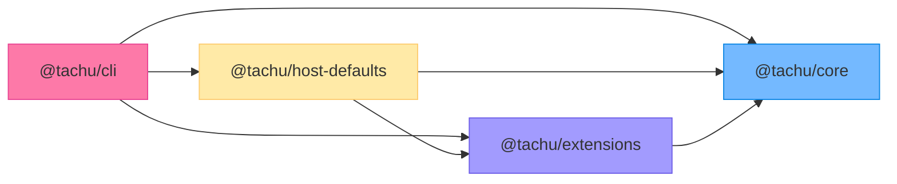

# Package Layout

> See also: [README](../../README.md) · [Detailed Design](../detailed-design.md)

### Package Summary

| Package | Description | Key Exports |
|---------|-------------|-------------|
| `@tachu/core` | Zero-dependency engine core | `Engine`, `Registry`, `PromptAssembler`, all interfaces and types |
| `@tachu/extensions` | Official implementations | `OpenAIProviderAdapter`, `AnthropicProviderAdapter`, `McpToolAdapter`, `QdrantVectorIndexAdapter`, `OtelEmitter`, backends, tools, rules |
| `@tachu/cli` | Production CLI program | `tachu chat`, `tachu run`, `tachu init`, `tachu memory`, `tachu approval` |
| `@tachu/host-defaults` | Shared CLI/embedded host wiring | `buildHostEngineDependencies`, provider inference, semantic retrieval facade, projection stack, semantic judge resolution |
| `@tachu/web-fetch-server` | Optional private sidecar | HTTP server for `web-fetch` / `web-search` remote rendering and extraction |

### Dependency Relationship



### Core Package Internal Structure

```
@tachu/core / src/
├── types/          # All TypeScript interfaces: descriptors, context, I/O, config
├── engine/         # Engine entry class, phase handlers, orchestrator, scheduler
├── registry/       # Registry: register/lookup/startup validation for all 4 abstractions
├── modules/        # 8 core modules (session, memory, runtime-state, model-router,
│                   #   provider, safety, observability, hooks)
├── prompt/         # PromptAssembler: token budgeting, KV-cache-friendly ordering
└── vector/         # VectorStore interface + built-in lightweight implementation
```

---
