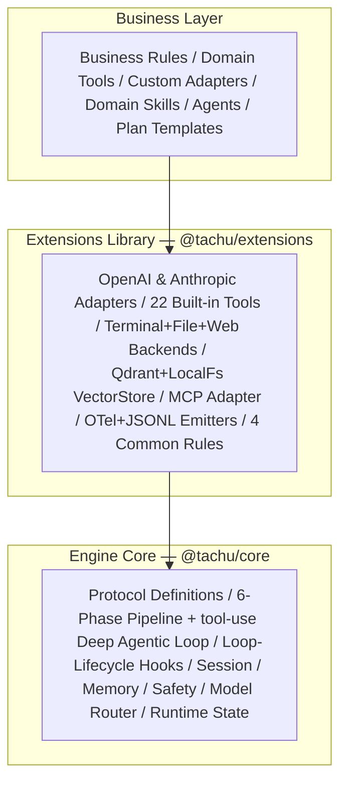
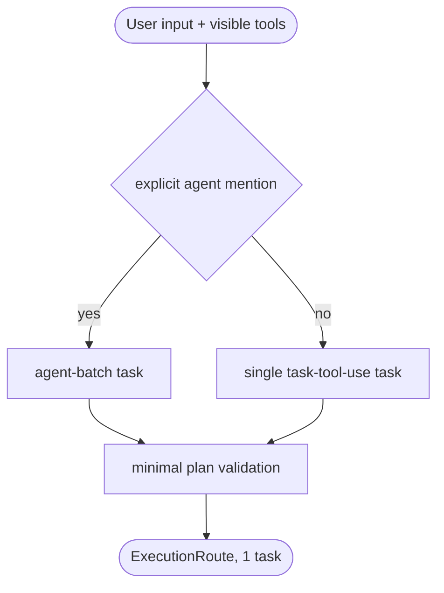
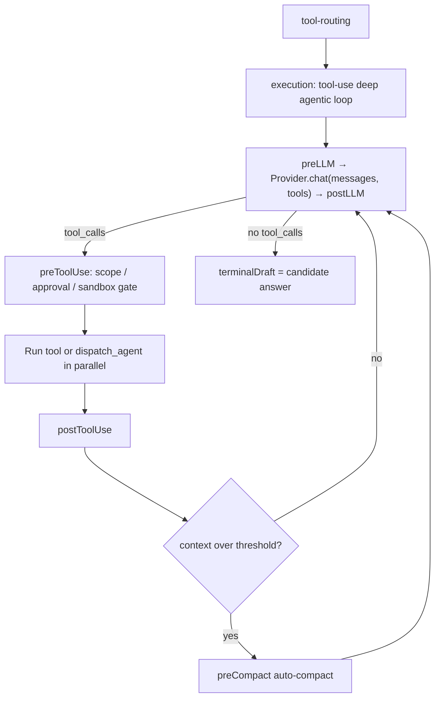
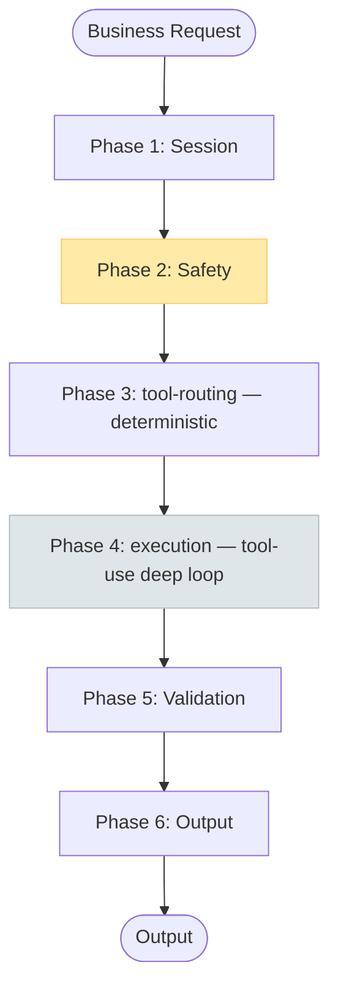
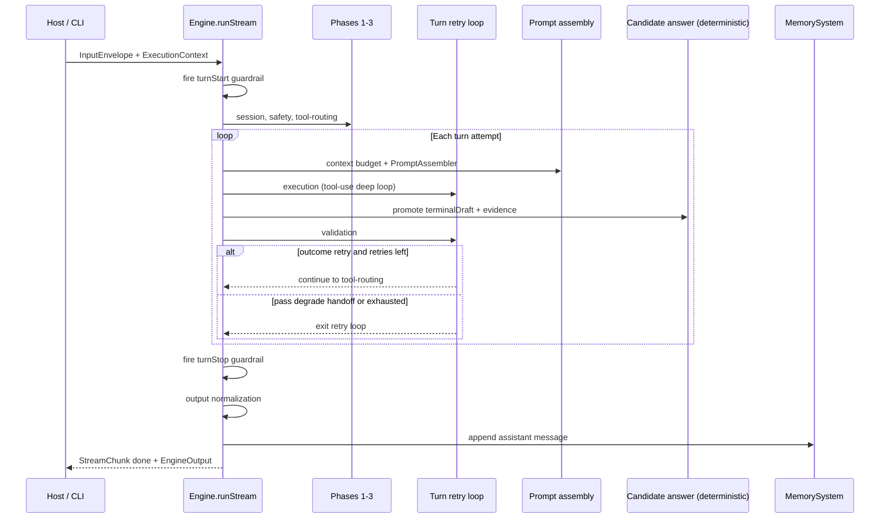
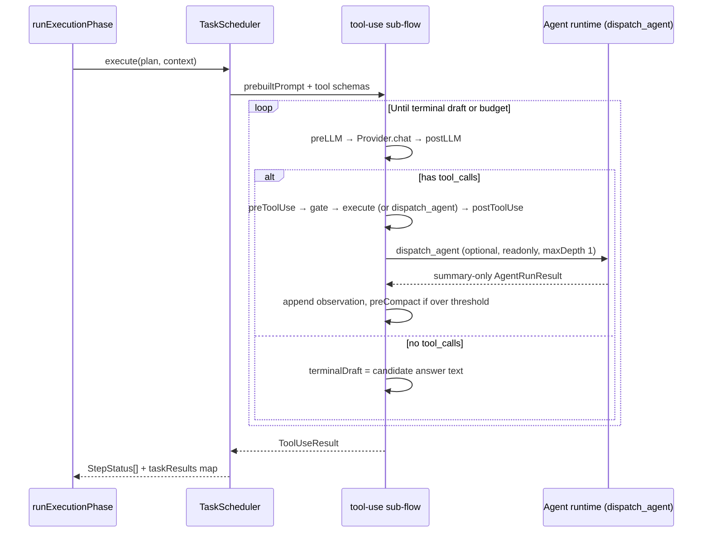
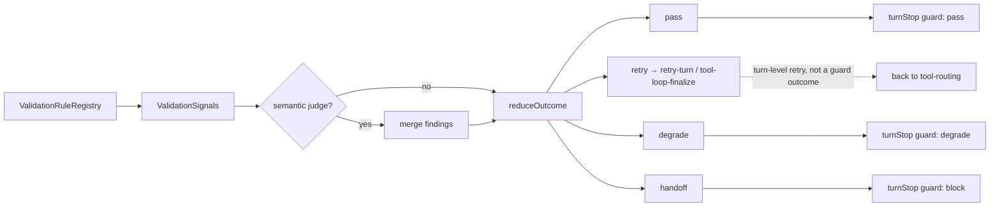

# Pipeline Phases

> See also: [README](../../README.md) · [Detailed Design](../detailed-design.md)

### Three-Layer Structure

Tachu is published as three main layers, with an optional Web Fetch sidecar alongside them:

| Layer | Package | Responsibility |
|-------|---------|----------------|
| Engine Core | `@tachu/core` | Protocol interfaces, 6-phase pipeline skeleton with a single deep `tool-use` agentic loop as its spine, 8 core modules, Registry, Prompt assembler, VectorStore interface + built-in light implementation |
| Extensions Library | `@tachu/extensions` | Official concrete implementations: Provider adapters, Tools, Backends, VectorStore adapters, OTel/JSONL emitters, common Rules |
| Business / CLI | `@tachu/cli` or your code | Assembles core + extensions into a working Agent; provides domain Rules/Skills/Tools/Agents |
| Optional Sidecar | `@tachu/web-fetch-server` | Private HTTP service backing `web-fetch` / `web-search`; deploy only when those tools are needed |

### Deep Single Loop + tool-routing (ADR-0006)

As of `0.2.0`, the engine no longer runs a 9-phase homogeneous pipeline. The former `intent` (LLM classification), `precheck`, `planning`, and `graph-check` phases — plus the built-in `direct-answer` sub-flow — have been collapsed into a **deterministic `tool-routing` phase** feeding **one deep `tool-use` agentic loop**, which is the engine's sole execution spine:

| Old (9-phase, removed) | New (`0.2.0`) |
|-------------------------|----------------|
| `intent` (LLM simple/complex classification) | Deleted. No LLM classification step exists anywhere in the pipeline. |
| `precheck` | Deleted. Provider/capability existence checks happen where they are needed (route resolution), not as a standalone phase. |
| `planning` (LLM-free router emitting `direct-answer` or `tool-use`) | Folded into `tool-routing`: always emits exactly one `tool-use` task. |
| `graph-check` | Folded into `tool-routing`: a minimal single-task graph validation (`topologicalSort` + registry lookups), kept for when the task count grows beyond one. |
| `direct-answer` built-in sub-flow | Physically deleted. "Answer with no tool call" is handled naturally by `tool-use` loop step 1 producing no `tool_call`. |

`tool-routing` (`packages/core/src/engine/phases/tool-routing.ts`) is **purely deterministic** — no LLM call, no `simple`/`complex` classification:

1. **`turnPolicy` normalization** — consumes only `SessionScope` and any pre-seeded `input.metadata.turnPolicy` (e.g. explicit CLI flags). Tool allow/deny and skill pin/exclude are **hard enforcement** driven by host/config/agent snapshot only — never guessed by a model.
2. **Tool-set narrowing** — when a `ToolActivator` is configured, `visibleTools` deterministically narrows the candidate tool set (relevance scoring + name matching + discovery expansion) instead of exposing the full registry.
3. **Routing branch** (independent of any removed complexity classification):
   - Explicit `@agent` mention → an `agent-batch` task (`TaskNode.type === "agent"`).
   - Everything else → exactly one `{ id: "task-tool-use", type: "sub-flow", ref: "tool-use", input: { prompt, toolNames? } }` task. A prompt with zero matching tools still produces this task — the loop still runs, and the model naturally answers in plain text when it emits no `tool_call`.
4. **Minimal plan validation** (replaces `graph-check`) — verifies referenced tool/agent descriptors exist and runs `topologicalSort` once (trivially passes for the single-task case, but keeps real cycle detection available if task count grows).
5. **Output constraint** — a single `ExecutionRoute` with `tasks.length ≥ 1` (no multi-plan `plans[]`).

Inside `tool-use`, the model receives the assembled prompt and available tool schemas, then repeats a step loop until it can answer or hits a budget — this loop (not a static multi-step plan) is where genuine multi-step reasoning now lives:

### 6-Phase Execution Pipeline

Every request flows through exactly 6 numbered phases, wrapping the single `tool-use` loop:

| # | Phase | `EnginePhase` value | LLM Call | Key Output |
|---|-------|----------------------|----------|------------|
| 1 | Session | `session` | No | Session context loaded |
| 2 | Safety | `safety` | No | Pass / reject, aggregated `violations[]` |
| 3 | tool-routing | `tool-routing` | No (deterministic) | `ExecutionRoute` with exactly 1 task (`tool-use`, or an agent batch for explicit `@agent` mentions) |
| 4 | Execution | `execution` | Yes, once per loop step | `ToolUseResult` (`terminalDraft`, tool observations, status) |
| 5 | Validation | `validation` | Optional semantic judge | `ValidationResult` with structured `ValidationOutcome` |
| 6 | Output | `output` | **No** | `EngineOutput` (typed, with steps, metadata, artifacts) |

These 6 values are the full `EnginePhase` union (`packages/core/src/types/io.ts`); there is no phase 7–9 anymore. `intent.ts` / `precheck.ts` / `planning.ts` / `graph-check.ts` / `direct-answer.ts` and their standalone tests have been physically deleted.

**Key pipeline properties:**

- **Full-path safety gating** — Phase 2 runs on every request; there is no fast-path that skips it.
- **No classification lane** — there is no `simple`/`complex` split anywhere; every request goes through the same 6 phases and the same loop.
- **`turnStart` / `turnStop` guardrails** — pre-guard and post-guard checkpoints wrap the loop (see below), both fail-closed.
- **Last-message-wins** — a new request on the same session cancels the current execution via `AbortController`.

### Loop-lifecycle: 9 HookPoints, two semantics

The old `HookPoint` union had 14 phase-named events, of which only one (`afterPlanning`) ever fired. ADR-0006 replaced it with **9 loop-lifecycle events**, each with a verified, tested fire site — `turnStart · preLLM · postLLM · preToolUse · postToolUse · turnStop · preSubagent · postSubagent · preCompact` (`packages/core/src/types/hooks.ts`).

Every hook point carries one of two semantics:

- **Guard** (`turnStart`, `turnStop`) — pre/post guard checkpoints on the unified `HookAction` seam. Handlers return `{ type: "guard"; decision: pass | block | degrade | annotate }` (fail-closed) or `{ type: "finding"; findings }` (ValidationRule output). Built-in guards: `turnStart` = SafetyModule baseline; `turnStop` = Result Validation. Hosts append more guards via `hooks.register("turnStart" | "turnStop", ...)`. Guards never silently reformat a passing answer — reformatting is an explicit transform, not a guard's job.
- **Free-mutation** (`preLLM`, `postLLM`, `preToolUse`, `postToolUse`, `preCompact`) — a host handler may return `{ type: "mutate"; data }` to rewrite the conversation, response, or tool result. These are constrained by the **Engine Seatbelt**: after any mutation, `tool-use.ts` structurally re-validates the result — a malformed mutation is discarded (with a `warning` event) rather than sent to the Provider, and `usage` always reflects the real Provider value regardless of mutation.

`preSubagent` / `postSubagent` are a third, narrower category — audit-only checkpoints around subagent dispatch (see below); `preSubagent` can still `deny` to prevent a dispatch.

| HookPoint | Semantics | Fire site |
|---|---|---|
| `turnStart` | Guard (pre) | `engine.ts`, before Phase 1 (`session`) |
| `preLLM` | Free-mutation | `tool-use.ts`, before each loop step's Provider call (also `engine.ts` for plan-preview approval when `planMode` is on) |
| `postLLM` | Free-mutation | `tool-use.ts`, after each loop step's Provider response |
| `preToolUse` | Free-mutation | `tool-use.ts`, before each tool call (unconditional; complements the existing conditional `onBeforeToolCall` approval callback) |
| `postToolUse` | Free-mutation | `tool-use.ts`, after each tool call, success or failure |
| `preCompact` | Free-mutation | `tool-use.ts`, when per-step estimated context exceeds `maxContextTokens * 0.85` |
| `turnStop` | Guard (post) | `engine.ts`, after Phase 5 (`validation`), before Phase 6 (`output`) |
| `preSubagent` | Audit / deny-only | `engine.ts`, inside `Engine.runSubAgent`, before spawning |
| `postSubagent` | Audit-only | `engine.ts`, inside `Engine.runSubAgent`, after completion |

Every `fire()` call unconditionally emits a `hook_fired` observability event (with `subscriberCount`/`registrarCount`), so even an unused hook point leaves an observable trace instead of silently doing nothing.

### `dispatch_agent`: subagent dispatch

The loop's LLM can decompose a read-only sub-task to a registered `agent` descriptor via a built-in Task-style tool, `dispatch_agent` (`tool-use.ts`, `AGENT_DISPATCH_TOOL_NAME`). Both this path and the deterministic `tool-routing`-produced `agent-batch` path (explicit `@agent` mention) share one implementation, `Engine.runSubAgent`:

- **Single-Writer Rule** — `Engine.filterReadonlyToolNames` deterministically restricts a subagent's `availableTools` to descriptors with `sideEffect === "readonly"`; any tool name that can't be resolved in the registry is fail-closed excluded (never assumed read-only). All write access stays with the main loop.
- **summary-only contract** — a subagent's `AgentRunResult` carries only an `output` + `evidence` summary, never the full sub-loop transcript.
- **`maxDepth` default `1`** (`DEFAULT_SUBAGENT_DISPATCH_MAX_DEPTH`, `packages/core/src/engine/agents/types.ts`) — nested subagent spawning is disabled by default (configurable via `runtime.toolLoop.subagentDispatch.maxDepth`), aligning with Claude Code's Task tool depth discipline.
- Zero new architectural surface — `dispatch_agent` is only exposed in the tool list when `ctx.dispatchAgent` is injected, `subagentDispatch.enabled !== false`, remaining depth allows it, and at least one `agent` descriptor is registered; otherwise it is omitted from the tool schema rather than exposed and failing at call time.
- `preSubagent` / `postSubagent` fire identically for both dispatch paths since both funnel through `Engine.runSubAgent`.

### Pipeline orchestration (`Engine.runStream`)

Phases 1–3 (`session`, `safety`, `tool-routing`) run once to set up the turn. Phases 4–5 (`execution`, `validation`) sit inside an optional **turn-level retry loop** (`runtime.maxTurnRetries`, default `0` — the do-while runs exactly once at the default). Between `tool-routing` and `execution` the engine runs **prompt assembly** (not a numbered phase, but on the critical path). Between `execution` and `validation` it runs a now-**deterministic** candidate-answer synthesis step — `terminalDraft` (already written by the loop under the full assembled prompt) is promoted directly to the candidate answer, with no independent "final-answer" LLM rewrite.

Implementation entry points: orchestrator in `packages/core/src/engine/engine.ts`; one module per numbered phase under `packages/core/src/engine/phases/`; the single built-in sub-flow (`tool-use`) in `packages/core/src/engine/subflows/`.

### Phase-by-phase implementation

Each subsection maps to a **deep module** in `@tachu/core`. Every phase emits `loop_step_enter` / `loop_step_exit` observability events (and structured `phase-enter` / `phase-exit` StreamChunks) and updates `RuntimeState.currentPhase`. Fine-grained progress inside the loop uses separate, flatter per-step events (`tool_loop_step_*` / `tool_call_*` / `llm_call_*` / `hook_fired`) rather than phase boundaries.

#### Phase 1 — Session

| | |
|---|---|
| **Module** | `packages/core/src/engine/phases/session.ts` |
| **LLM** | No |
| **Input → Output** | `InputEnvelope` → `{ input, context }` with session + memory hydrated |

Steps:

1. Resolve or create the session record via `SessionManager`.
2. Load the context window from `MemorySystem` (file-backed or in-memory, per config).
3. Append the current user message as a memory entry (crash-safe append-before-process).
4. Return unchanged `input` and `context` for downstream phases.

#### Phase 2 — Safety

| | |
|---|---|
| **Module** | `packages/core/src/engine/phases/safety.ts` |
| **LLM** | No |
| **Input → Output** | `{ input, context }` → same + aggregated `violations[]` |

Steps:

1. **Fail-closed baseline** — input size, recursion depth, budget headroom, workspace root; prompt-injection patterns emit warnings only.
2. **Business policies** — registered via `SafetyModule.registerPolicy`; fatal violations throw, warnings are forwarded.
3. Immediately after this phase, the `turnStart` guard runs: the built-in guard maps these `violations` to `annotate`/`degrade`/`block`, and any host guards registered via `hooks.register("turnStart", ...)` run next, fail-closed.

#### Phase 3 — tool-routing

| | |
|---|---|
| **Module** | `packages/core/src/engine/phases/tool-routing.ts` |
| **LLM** | **No** — fully deterministic |
| **Input → Output** | `SafetyPhaseOutput` → same + `ExecutionRoute` with `tasks.length === 1` |

See "Deep Single Loop + tool-routing" above for the full routing algorithm. On a turn retry, `tool-routing` emits a `previous-attempt-injected` observability event when `PhaseEnvironment.previousAttempt` is set — purely diagnostic, since routing itself never changes shape based on prior attempts.

#### Between tool-routing and execution — Prompt assembly (engine-internal)

Not a numbered phase, but the engine always runs this block in `engine.ts` before `execution`:

1. **Context distribution** — slice rules/constraints per task via `ContextDistributor`.
2. **Context budget** — `ContextBudgetBroker` may trim, compress, chunk, degrade, or reject; emits `context_budget` events.
3. **Skill recall** — sticky + semantic candidate strategies resolve active skills for this turn (once per turn; further discovery happens inside the loop via `load_skill`/`search_skills`).
4. **PromptAssembler** — KV-cache-friendly ordering: hard rules → skills → tool schemas → history + recall + current input; respects `trimOrder` from budget broker.
5. Result stored in `activeRunPrompts` and passed into the `tool-use` sub-flow as `prebuiltPrompt`.

#### Phase 4 — Execution (`tool-use` deep agentic loop)

| | |
|---|---|
| **Module** | `packages/core/src/engine/phases/execution.ts` + `packages/core/src/engine/scheduler.ts` + `packages/core/src/engine/subflows/tool-use.ts` |
| **LLM** | Once per loop step |
| **Input → Output** | `ToolRoutingPhaseOutput` → `{ steps, taskResults, taskErrors }`, with `taskResults["task-tool-use"]` holding a `ToolUseResult` |

Only one built-in sub-flow remains registered in `InternalSubflowRegistry` (`packages/core/src/engine/subflows/registry.ts`):

| Task ID | Ref | Behaviour |
|---------|-----|-----------|
| `task-tool-use` | `tool-use` | Deep agentic loop: LLM ↔ execution gate (scopes / approval / sandbox) ↔ tool executor ↔ optional `dispatch_agent`; max steps from `runtime.toolLoop.maxSteps` (default 25); a no-tool-call step naturally produces the final plain-text answer (subsuming the deleted `direct-answer` sub-flow); streams loop events to host |
| `task-agent-*` | registered agent | `DefaultAgentRuntimeAdapter`, shares `Engine.runSubAgent` with `dispatch_agent` |

Absorbed from the deleted `direct-answer` sub-flow, now living inside `tool-use.ts`:

- **Media / image passthrough** — `onGeneratedImages` / `onGeneratedMedia` fire whenever a loop step's Provider response carries generated images/media.
- **No-empty-promise guard** — a mandatory clause in the loop's base system prompt (a deterministic, always-on constraint rather than a dynamic rule, to avoid rule-matching overhead).
- **`shortTaskRoute` cheap route** — when `runtime.toolLoop.shortTaskRoute.enabled` and the turn looks like a short single-tool task (few tool names, short prompt), the loop tries a cheaper capability (typically `fast-cheap`) before falling back to the default `high-reasoning → fast-cheap` chain.

The scheduler honours `runtime.maxConcurrency`, `defaultTaskTimeoutMs`, `failFast`, and propagates `AbortSignal` into every Provider call and tool execution inside the loop.

#### Between execution and validation — Candidate answer synthesis (deterministic)

| | |
|---|---|
| **Module** | `packages/core/src/engine/phases/candidate-answer.ts` |
| **LLM** | **No** — no independent "final answer writer" call anymore |
| **Purpose** | Build `{ content, claims, evidence }` for Result Validation |

Steps:

1. **Collect evidence** — tool observations, agent-run evidence, file-write records, external-source refs (descriptor-grounded, not keyword regex).
2. **`tool-use` path** — when `ToolUseResult.status === "ready_for_output"`, `terminalDraft` (already written by the loop under the full `prebuiltPrompt`) is promoted verbatim as candidate content; any other status yields empty content, so `validation`'s deterministic `tool-use.status` rule can honestly flag the failure instead of a synthesized narrative papering over it.
3. **`agent` path** — Markdown synthesis of agent outputs, when the plan resolved to an `agent-batch`.

This removes the historical "final-answer writer" LLM call that used to run over a thin system prompt (a source of format drift against the loop's own rules/skills-aware system prompt) — the candidate answer is now exactly what the loop itself produced.

#### Phase 5 — Validation

| | |
|---|---|
| **Module** | `packages/core/src/engine/phases/validation/phase.ts` |
| **LLM** | Optional semantic judge when `validation.policyMode` is `always` or `auto` (and adapter registered) |
| **Input → Output** | `CandidateAnswerPhaseOutput` → same + `ValidationResult` with `ValidationOutcome` |

Result Validation is the built-in **`turnStop` guard** — validation itself stays a phase producing structured findings, but its outcome flows into the same `HookGuardDecision` (`pass | block | degrade | annotate`) vocabulary used at `turnStart`.

Steps:

1. Run deterministic rules via `ValidationRuleRegistry` (`policyMode` default `deterministic-only`).
2. Build `ValidationSignals` — uses descriptor `sideEffect` for write detection (not step-name regex).
3. Optionally invoke `SemanticJudgeAdapter` under budget when policy allows and signals warrant it.
4. `reduceOutcome` → `pass` / `retry` (`target: retry-turn | tool-loop-finalize`) / `degrade` / `handoff`.
5. **Turn retry** (`runtime.maxTurnRetries > 0`, via `decideTurnRetry`): on `retry` + `target=retry-turn`, the engine loops back to `tool-routing` with `previousAttempt` injected.
6. **`turnStop` guard**: `handoff → block`, `degrade → degrade`, `pass`/`retry → pass` (retry is a turn-level concern); `block` rejects delivery, `degrade`/`annotate` prefix the final content.

#### Phase 6 — Output

| | |
|---|---|
| **Module** | `packages/core/src/engine/phases/output.ts` |
| **LLM** | **No** (no post-validation LLM calls, ever) |
| **Input → Output** | `ValidationPhaseOutput` → `EngineOutput` |

Content selection priority:

1. Validation passing + non-empty `candidateAnswer.content` → deliver candidate (sanitized).
2. Validation passing + agent results only → agent synthesis text.
3. Validation passing + no natural-language candidate → structured JSON `{ intent, taskResults }` (tool-only paths).
4. Validation failing + partial tool-use candidate → local tool-observation fallback text.
5. Otherwise → `ensureFallbackText()`, which **always** returns a local, deterministic template (≥ 30 chars, no internal terms) — it never calls an LLM, even as a best-effort attempt. If a friendlier LLM-authored fallback is ever wanted, it must be synthesized *before* `validation` as part of the `CandidateAnswer` so `validation`/`turnStop` can judge it like any other answer, not injected after failure has already been declared.

After Phase 6: engine appends the assistant message to `MemorySystem`, then yields `done` with token usage, steps, tool-call records, and optional `generatedImages` / `generatedMedia` metadata.

---
