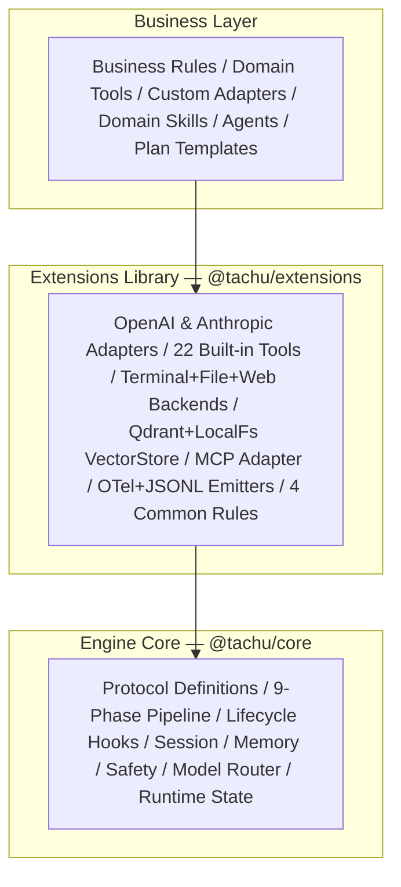
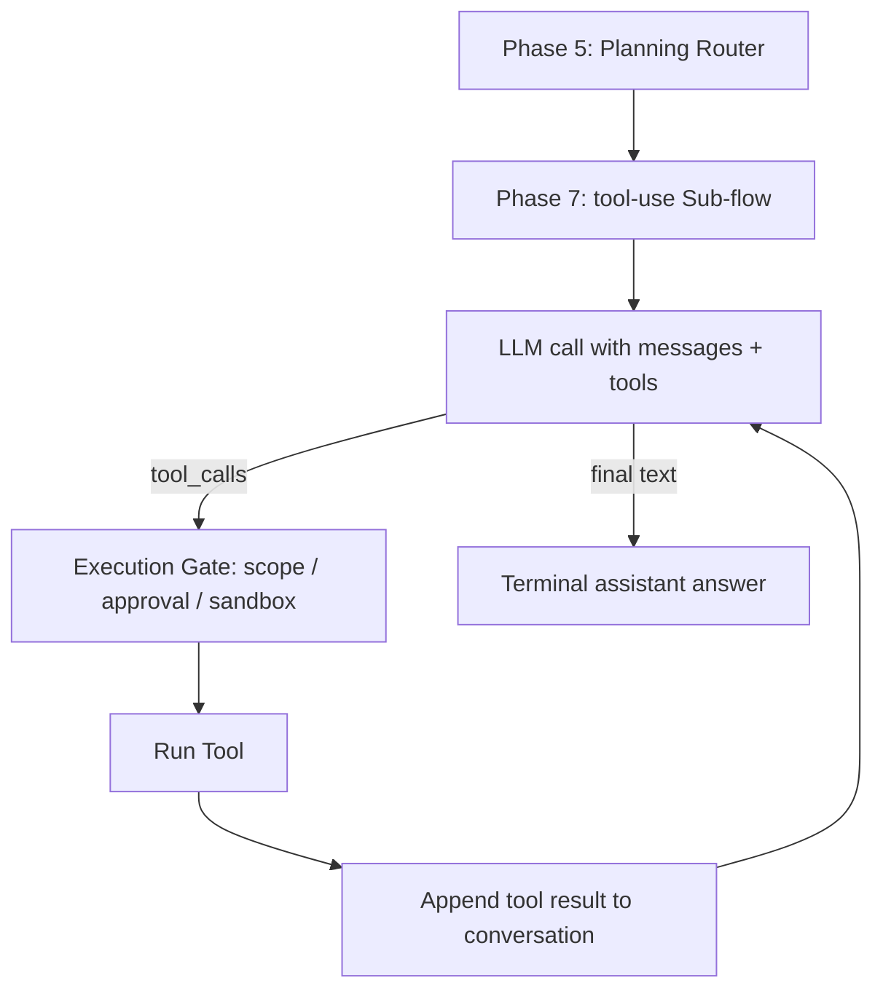
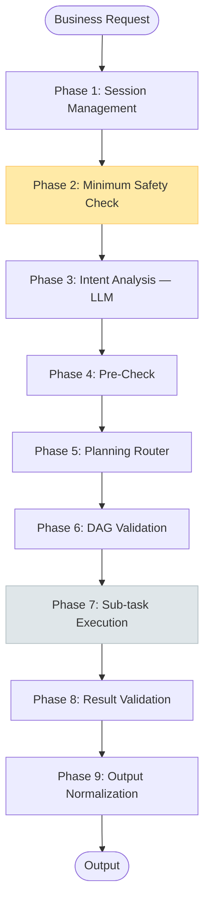
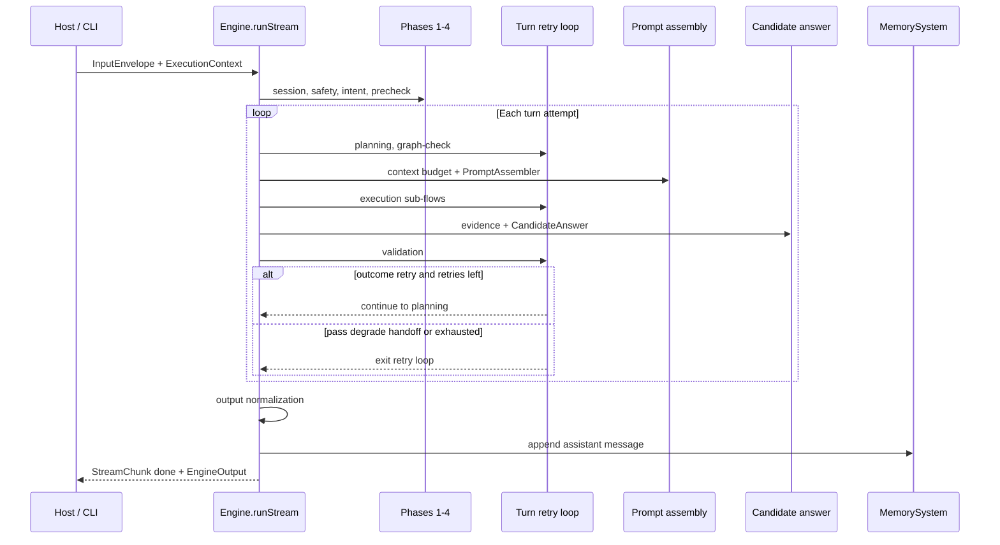
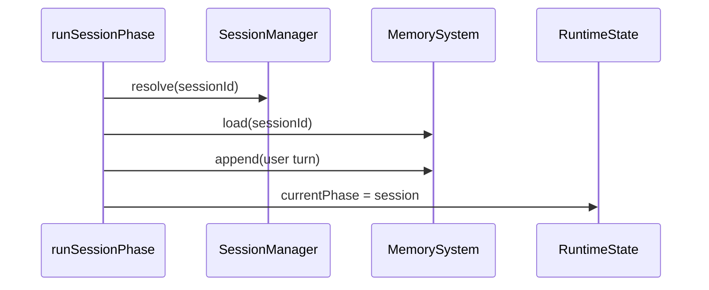
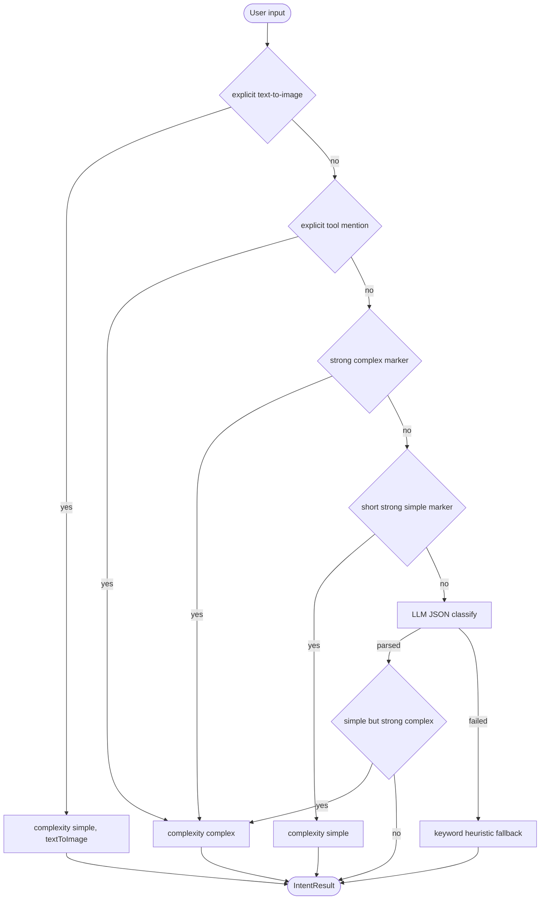
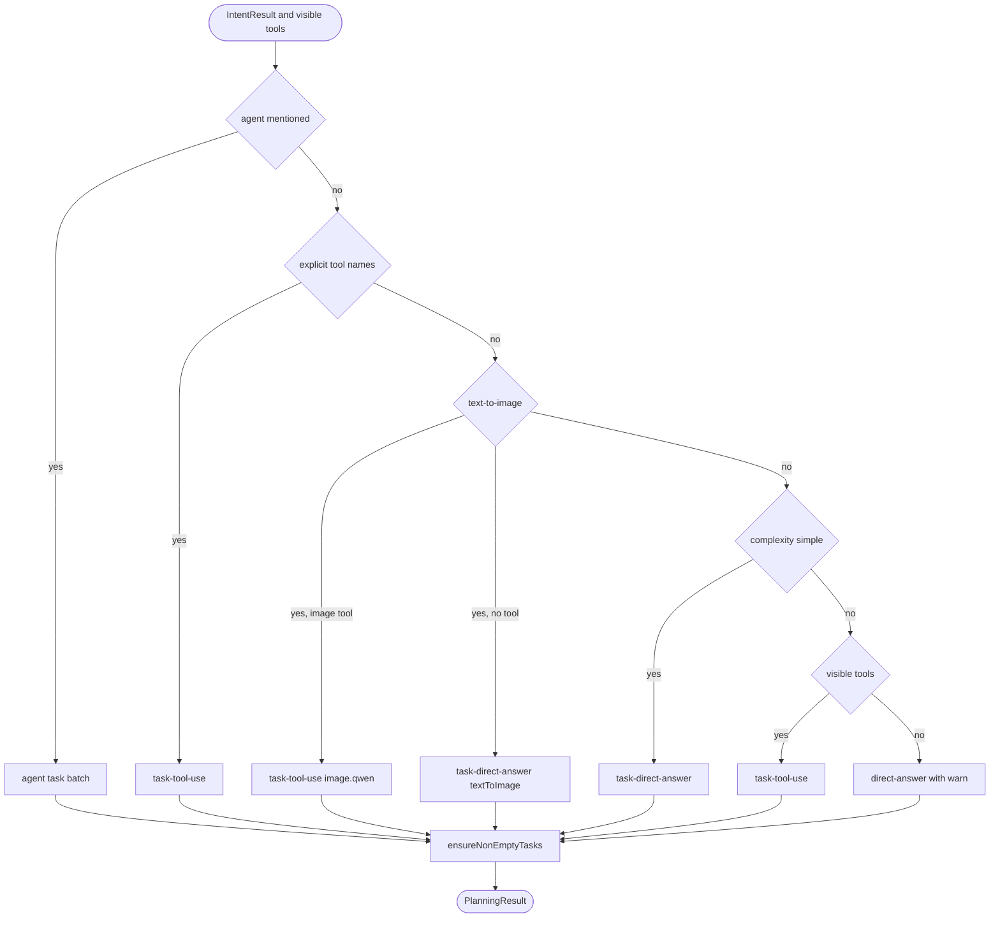
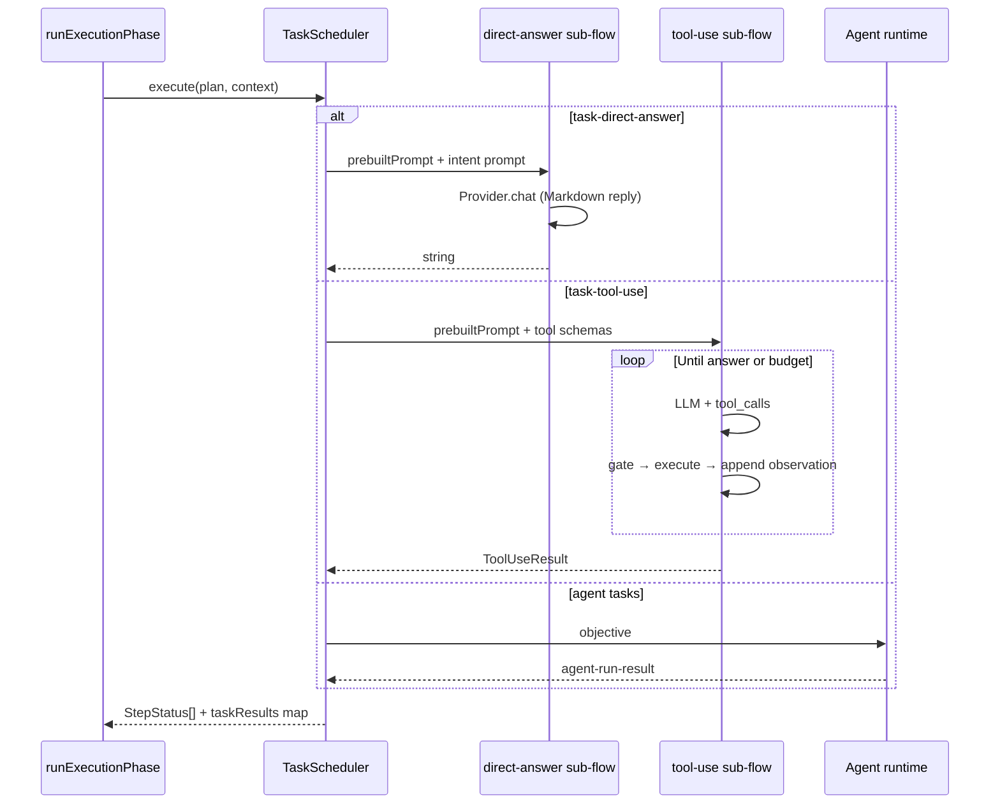
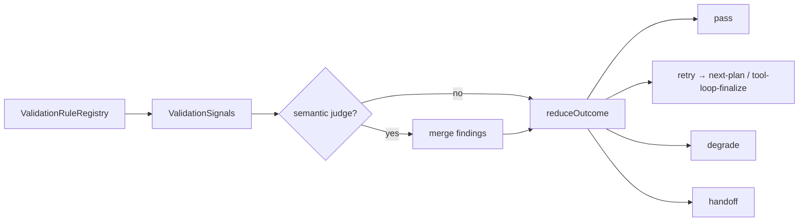

# Pipeline Phases

> See also: [README](../../README.md) · [Detailed Design](../detailed-design.md)

### Three-Layer Structure

Tachu is published as three main layers, with an optional Web Fetch sidecar alongside them:



| Layer | Package | Responsibility |
|-------|---------|----------------|
| Engine Core | `@tachu/core` | Protocol interfaces, 9-phase pipeline skeleton, 8 core modules, Registry, Prompt assembler, VectorStore interface + built-in light implementation |
| Extensions Library | `@tachu/extensions` | Official concrete implementations: Provider adapters, Tools, Backends, VectorStore adapters, OTel/JSONL emitters, common Rules |
| Business / CLI | `@tachu/cli` or your code | Assembles core + extensions into a working Agent; provides domain Rules/Skills/Tools/Agents |
| Optional Sidecar | `@tachu/web-fetch-server` | Private HTTP service backing `web-fetch` / `web-search`; deploy only when those tools are needed |

### Task Planning + Tool-use Loop

The default complex path is **not** a separate LLM planner that emits a complete ranked task DAG before execution. In `1.0.0-rc.0`, Phase 5 is a deterministic planning router:

| Intent path | Phase 5 output | Where reasoning happens |
|-------------|----------------|-------------------------|
| `simple` | one `direct-answer` sub-flow task | `direct-answer` produces the final Markdown reply |
| `complex` + visible tools | one `tool-use` sub-flow task | `tool-use` runs the Agentic Loop and decides tools step by step |
| `complex` + no visible tools | one `direct-answer` sub-flow task with `warn: true` | `direct-answer` gives an honest tool-missing answer |

Inside `tool-use`, the model receives the assembled prompt and available tool schemas, then repeats this loop until it can answer or hits a budget:



This keeps the 9-phase pipeline stable while putting multi-step planning where it has the most information: inside the feedback loop after each tool observation. An optional Plan Preview / Human Review mode may still be built on top of Phase 5 later, but it is not the default execution path.

### 9-Phase Execution Pipeline

Every request processed by the engine flows through exactly 9 phases:



| # | Phase | LLM Call | Key Output |
|---|-------|----------|------------|
| 1 | Session Management | No | Session context loaded |
| 2 | Minimum Safety Check | No | Pass / reject |
| 3 | Intent Analysis | **Yes** | `IntentResult` (simple/complex, context relevance) |
| 4 | Pre-Check | No | Resource availability, deep safety validation |
| 5 | Task Planning | No | `PlanningResult` with at least one task (`direct-answer` or `tool-use`) |
| 6 | DAG Validation | No | Cycle detection, node integrity (deterministic) |
| 7 | Sub-task Execution | Per sub-task | `TaskResult[]` (parallel where possible) |
| 8 | Result Validation | No | `ValidationResult` with structured `ValidationOutcome`; semantic judge validation remains on the roadmap |
| 9 | Output Normalization | No | `EngineOutput` (typed, with steps, metadata, artifacts) |

**Key pipeline properties:**

- **Full-path safety gating** — Phase 2 runs on every request, including fast-path simple responses
- **Context guard** — Phase 3 decides whether session history is relevant; irrelevant history is not forwarded
- **Three-strikes limit** — Task-level retries are bounded at 3 (configurable); system-level retries at 2
- **Last-message-wins** — A new request on the same session cancels the current execution via `AbortController`

### Pipeline orchestration (`Engine.runStream`)

Phases 1–4 always run once per user turn. Phases 5–8 sit inside an optional **turn-level retry loop** (`runtime.maxTurnRetries`, default `0`). Between Phase 6 and Phase 7 the engine also runs **prompt assembly** (not a numbered phase, but on the critical path). Between Phase 7 and Phase 8 it runs **candidate-answer synthesis** so Result Validation can judge claims against evidence before Output renders anything.



Implementation entry points: orchestrator in `packages/core/src/engine/engine.ts`; one module per numbered phase under `packages/core/src/engine/phases/`; built-in sub-flows in `packages/core/src/engine/subflows/`.

### Phase-by-phase implementation

Each subsection maps to a **deep module** in `@tachu/core`: a small typed interface (`run*Phase`) with most behaviour behind it. Every phase emits `phase_enter` / `phase_exit` observability events and updates `RuntimeState.currentPhase`.

#### Phase 1 — Session Management

| | |
|---|---|
| **Module** | `packages/core/src/engine/phases/session.ts` |
| **LLM** | No |
| **Input → Output** | `InputEnvelope` → `{ input, context }` with session + memory hydrated |



Steps:

1. Resolve or create the session record via `SessionManager`.
2. Load the context window from `MemorySystem` (file-backed or in-memory, per config).
3. Append the current user message as a memory entry (crash-safe append-before-process).
4. Return unchanged `input` and `context` for downstream phases.

#### Phase 2 — Minimum Safety Check

| | |
|---|---|
| **Module** | `packages/core/src/engine/phases/safety.ts` |
| **LLM** | No |
| **Input → Output** | `{ input, context }` → same + aggregated `violations[]` |

```mermaid
sequenceDiagram
    participant S as runSafetyPhase
    participant Baseline as SafetyModule.checkBaseline
    participant Biz as SafetyModule.checkBusiness

    S->>Baseline: input + context
    Note over Baseline: size / recursion / budget / workspace — error → throw
    S->>Biz: input + context, scope "safety"
    Note over Biz: business policies — error → throw; warning → collect
    S-->>S: violations = baseline ∪ business warnings
```

Steps:

1. **Fail-closed baseline** — input size, recursion depth, budget headroom, workspace root; prompt-injection patterns emit warnings only.
2. **Business policies** — registered via `SafetyModule.registerPolicy`; fatal violations throw, warnings are forwarded.
3. Every request path passes Phase 2, including `simple` fast paths.

#### Phase 3 — Intent Analysis

| | |
|---|---|
| **Module** | `packages/core/src/engine/phases/intent.ts` |
| **LLM** | **Yes** (`capabilityMapping.intent`, always) — multimodal input is reduced to lightweight `[Image #N]` / `[File #N]` placeholder tokens (zero-materialization), so intent never routes to `vision` and never receives base64 |
| **Host** | To consume opaque resource refs, register a `MultimodalResolver.resolveResources(refs, ctx)` on `EngineDependencies`; refs are materialized **on demand at the provider boundary** (not at intent), inline `data:`/`http(s):` images are carried without the resolver, and multi-turn fidelity holds for sessions **created on this version onward**. Optionally inject `resourceDemandRouter` to drive **token-level on-demand materialization** (which refs each model/tool call expands); default keeps full fidelity |
| **Input → Output** | `SafetyPhaseOutput` → same + `IntentResult` |

`IntentResult = { complexity, intent, contextRelevance, relevantContext?, textToImage? }`. Phase 3 is **classification only** — it never produces the final user-facing answer.



Steps:

1. **Fast paths** (no LLM): CLI `/draw` or `metadata.explicitTextToImage`; `@tool` name match; URL/path/command/realtime **strong complex** regex; short **strong simple** regex (≤ 40 chars).
2. **LLM path**: `INTENT_SYSTEM_PROMPT_BASE` in `intent.ts` (4 embedded JSON examples; optional `config.intent.fewShotExamples`) + up to 10 recent memory entries + current turn → `ProviderAdapter.chat` with composed timeout; parse strict JSON (fenced / embedded tolerant).
3. **Degrade gracefully**: provider missing, timeout, or parse failure → keyword heuristic; budget exhaustion → throw (no silent fallback).
4. **Post-guard**: if LLM returns `simple` but input contains strong complex signals, force upgrade to `complex`.
5. Optional `textToImage` flag is written to input metadata for Phase 5 routing.

#### Phase 4 — Pre-Check

| | |
|---|---|
| **Module** | `packages/core/src/engine/phases/precheck.ts` |
| **LLM** | No |
| **Input → Output** | `PrecheckPhaseOutput` (pass-through) |

Steps:

1. If `metadata.textToImage`, verify `text-to-image` capability provider is registered.
2. For each backbone capability (`intent`, and `planning` / `validation` / `output` when configured in `capabilityMapping`), resolve route and assert provider exists.
3. Throws `ProviderError.unavailable` early instead of failing mid-execution.

#### Phase 5 — Planning Router

| | |
|---|---|
| **Module** | `packages/core/src/engine/phases/planning.ts` |
| **LLM** | No (deterministic router) |
| **Input → Output** | `PrecheckPhaseOutput` → same + `PlanningResult` with `plans[0].tasks.length ≥ 1` |



Steps:

1. **Tool activation**: `ToolActivator` scores registry tools (+ `scope.additionalTools`) into `visibleTools` / `matchedToolNames`.
2. **Routing priority**: explicit agent mentions → agent tasks; explicit tool mentions → single `tool-use` task with pinned tools; text-to-image → `tool-use` with `image.qwen` or `direct-answer`; `simple` → `direct-answer`; `complex` + tools → `tool-use` (optional `run-shell`-only limit for “current time” queries); `complex` + no tools → `direct-answer` with `warn: true`.
3. Build a single ranked plan with linear `edges` between tasks.
4. On turn retry, emit `previous-attempt-injected` when `PhaseEnvironment.previousAttempt` is set.
5. **Post-guard** `ensureNonEmptyTasks`: empty list → forced `direct-answer` fallback.

#### Phase 6 — DAG Validation

| | |
|---|---|
| **Module** | `packages/core/src/engine/phases/graph-check.ts` |
| **LLM** | No |
| **Input → Output** | `GraphCheckPhaseOutput` (validated plan) |

Steps:

1. Assert `plans[0]` exists.
2. For each `tool` / `agent` task node, verify descriptor exists in `DescriptorRegistry`.
3. Run `topologicalSort(tasks, edges)` — cycle or missing node → `PlanningError.invalidPlan`.

#### Between Phase 6 and Phase 7 — Prompt assembly (engine-internal)

Not a numbered phase, but every non–text-to-image run executes this block in `engine.ts` before `runExecutionPhase`:

1. **Context distribution** — slice rules/constraints per task via `ContextDistributor`.
2. **Context budget** — `ContextBudgetBroker` may trim, compress, chunk, degrade, or reject; emits `context_budget` events.
3. **Skill recall** — sticky + semantic candidate strategies resolve active skills for this turn.
4. **PromptAssembler** — KV-cache-friendly ordering: hard rules → skills → tool schemas → history + recall + current input; respects `trimOrder` from budget broker.
5. Result stored in `activeRunPrompts` and passed into `direct-answer` / `tool-use` sub-flows as `prebuiltPrompt`.

#### Phase 7 — Sub-task Execution

| | |
|---|---|
| **Module** | `packages/core/src/engine/phases/execution.ts` + `packages/core/src/engine/scheduler.ts` |
| **LLM** | Per sub-flow (see below) |
| **Input → Output** | `GraphCheckPhaseOutput` → `{ steps, taskResults, taskErrors }` |



Built-in sub-flows (`packages/core/src/engine/subflows/`):

| Task ID | Ref | Behaviour |
|---------|-----|-----------|
| `task-direct-answer` | `direct-answer` | Uses assembled prompt; routes `intent` → `fast-cheap`; 60 s timeout; Markdown-only reply; `warn: true` adds honest “no matching tool” disclaimer |
| `task-tool-use` | `tool-use` | Agentic loop: LLM ↔ execution gate (scopes / approval / sandbox) ↔ tool executor; max steps from `toolLoop.maxSteps`; streams loop events to host |
| `task-agent-*` | registered agent | `DefaultAgentRuntimeAdapter` single LLM call; full tool loop remains on the roadmap |

The scheduler honours `runtime.maxConcurrency`, `defaultTaskTimeoutMs`, `failFast`, and propagates `AbortSignal`.

#### Candidate answer synthesis (between Phase 7 and Phase 8)

| | |
|---|---|
| **Module** | `packages/core/src/engine/phases/candidate-answer.ts` |
| **LLM** | Optional — tool-use path may call LLM once to polish observations into a **Candidate Answer** |
| **Purpose** | Build `{ content, claims, evidence }` for Result Validation; Output Phase must not invent new completed claims ([CONTEXT.md](../../CONTEXT.md)) |

Steps:

1. **Collect evidence** — tool observations, agent-run evidence, file-write records, external-source refs (descriptor-grounded, not keyword regex).
2. **`direct-answer` path** — promote sub-flow string output as candidate (claims empty; validation is lighter).
3. **`tool-use` path** — LLM “final answer writer” over observations + terminal draft; on failure, deterministic local fallback text.
4. **`agent` path** — Markdown synthesis of agent outputs.
5. Streaming: `onFinalAnswerDelta` feeds host before validation completes.

#### Phase 8 — Result Validation

| | |
|---|---|
| **Module** | `packages/core/src/engine/phases/validation/phase.ts` |
| **LLM** | Optional semantic judge when `validation.policyMode` is `always` or `auto` (and adapter registered) |
| **Input → Output** | `CandidateAnswerPhaseOutput` → same + `ValidationResult` with `ValidationOutcome` |



Steps:

1. Run deterministic rules (`evidence-required`, execution failures, output length budget, …) via `ValidationRuleRegistry`.
2. Build `ValidationSignals` — uses descriptor `sideEffect` for write detection (not step-name regex).
3. Optionally invoke `SemanticJudgeAdapter` under budget when policy allows.
4. `reduceOutcome` → `pass` / `retry` / `degrade` / `handoff`.
5. **Turn retry** (`runtime.maxTurnRetries > 0`): on `retry` + `target=next-plan`, engine loops back to Phase 5 with `previousAttempt` injected; tool-loop partial retries target `tool-loop-finalize` inside the sub-flow.

Current rc.0 maturity: five deterministic rules, turn retry, and degrade/handoff exit paths are wired; optional semantic judge remains partial. **Runtime provider fallback** (automatic switch on `ProviderError`) is **not implemented** and planned for **v1.x+**; see [Project Status](../../README.md#project-status).

#### Phase 9 — Output Normalization

| | |
|---|---|
| **Module** | `packages/core/src/engine/phases/output.ts` |
| **LLM** | **No** (no post-validation LLM calls) |
| **Input → Output** | `ValidationPhaseOutput` → `EngineOutput` |

Content selection priority:

1. Validation passing + non-empty `candidateAnswer.content` → deliver candidate (sanitized).
2. Validation passing + agent results only → agent synthesis text.
3. Validation passing + no natural-language candidate → structured JSON `{ intent, taskResults }` (tool-only paths).
4. Validation failing + partial tool-use candidate → local tool-observation fallback text.
5. Otherwise → deterministic `ensureFallbackText()` template (≥ 30 chars, no internal terms).

After Phase 9: engine appends the assistant message to `MemorySystem`, then yields `done` with token usage, steps, tool-call records, and optional `generatedImages` / `generatedMedia` metadata.

---
